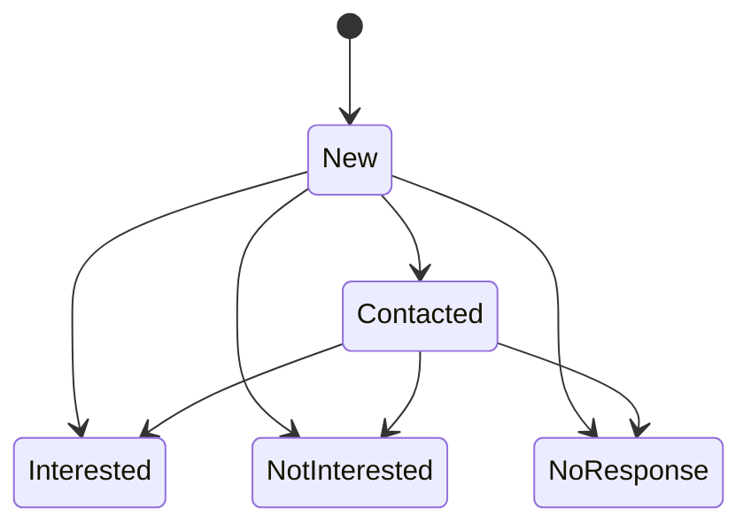
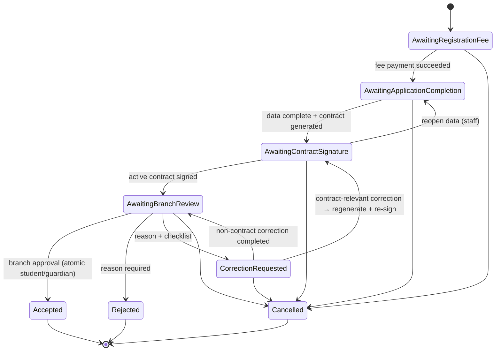
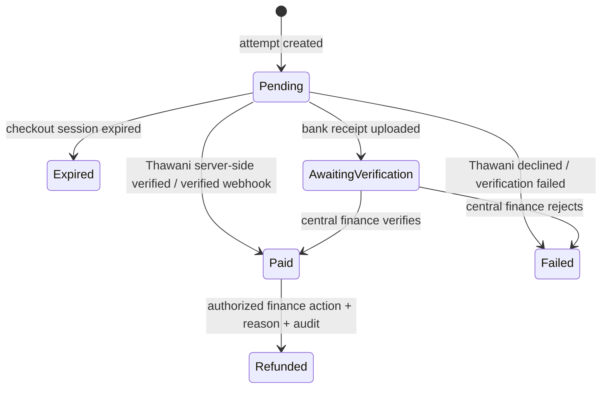
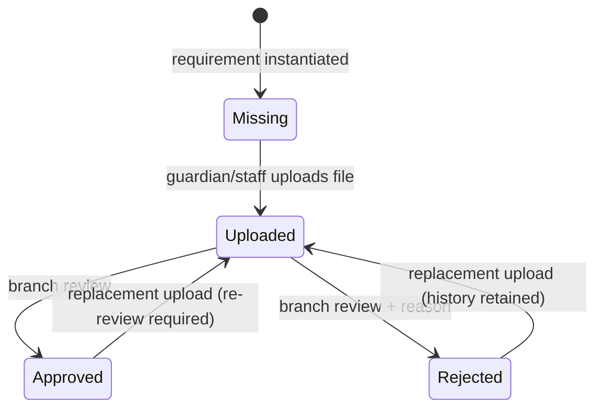
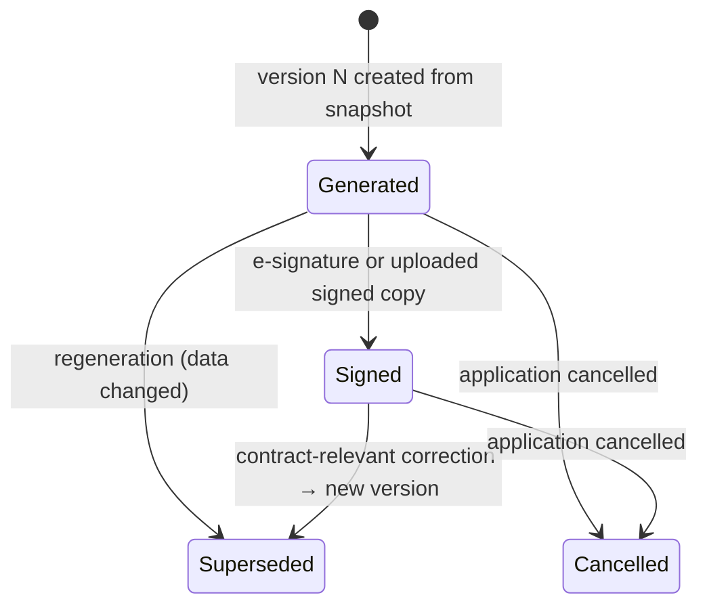

# Target Registration Architecture

Implementation-ready target architecture for the registration domain: lead, application, payment, document, and contract lifecycles. This document is the blueprint for the next implementation cycles. No production code changes in this cycle.

Legend used throughout:

- **[Confirmed]** — approved business requirement from the architecture brief. Do not change without stakeholder sign-off.
- **[Recommendation]** — technical proposal chosen by engineering; may be revisited during implementation review.

Environment note for this cycle: the Laravel Boost MCP tools were not available in the authoring session, and the local PHP CLI is 8.3.32 while `composer.json` requires PHP >= 8.4, so `php artisan` and the test suite cannot run on this machine. Package versions below were confirmed from `composer.lock`: `spatie/laravel-model-states 2.13.1`, `spatie/laravel-permission 7.3.0`, `bezhansalleh/filament-shield 4.2.0`, `laravel/sanctum v4.3.1`, `laravel/framework v13.4.0`, `owen-it/laravel-auditing v14.0.3`, `spatie/laravel-webhook-server 3.10.0`, `carlos-meneses/laravel-mpdf 2.1.13`.

---

## 1. Current-state findings

Grounded in exact file paths on `develop` at commit `3bc0659`.

### 1.1 What exists and works

- Lead state machine: `app/States/Leads/LeadState.php` configures `new -> contacted`, and `new|contacted -> interested|not_interested|no_response` with transition classes under `app/States/Leads/Transitions/`. `ContactedLeadToInterested` validates program/branch availability, records a `lead_contacts` row, and calls `app/Actions/Applications/ConvertLeadToApplicationAction.php`.
- Application state machine: `app/States/Applications/ApplicationState.php` configures `draft -> submitted -> waiting_contract_signature -> under_review`, plus `waiting_contract_signature -> submitted`, and `draft|submitted -> cancelled`. State string values: `draft`, `submitted`, `waiting_contract_signature`, `under_review`, `accepted`, `rejected`, `cancelled`.
- Contract generation: `app/Actions/Applications/GenerateApplicationContractAction.php` runs inside `SubmittedToWaitingContractSignature` (`app/States/Applications/Transitions/SubmittedToWaitingContractSignature.php`), creating one `application_contracts` row per application with a 64-char token and 7-day expiry.
- Online signing: `routes/web.php` exposes `GET|POST /contract/{token}` via `app/Http/Controllers/ContractSigningController.php`, which delegates to `app/Actions/Applications/SignContractOnlineAction.php` (validates state + token, stores base64 PNG signature, generates a PDF via `app/Actions/Support/CreatePdfAction.php`, transitions to `under_review`).
- Activity trail: `app/Actions/Applications/RecordApplicationActivityAction.php` writes to `application_activities` (`database/migrations/2026_04_22_150757_create_application_activities_table.php`) from every transition class.
- Branch scoping: `app/Models/Scopes/BranchScope.php` filters `Lead`, `Application`, `Student` by `Auth::user()->branch_id` unless the user has the `super_admin` role or a null `branch_id`.
- Shield: policies exist for all major models under `app/Policies/` and use the Shield permission format `ViewAny:Application` (`config/filament-shield.php` — separator `:`, case `pascal`).
- Auditing: `owen-it/laravel-auditing` is installed; `User` and `Affiliate` are `Auditable`.
- Denormalized application schema: `database/migrations/2026_04_22_145705_create_applications_table.php` stores student, father, mother, and relative fields directly on `applications` with `lead_id` unique+nullable.

### 1.2 What does not exist yet

- No payment, invoice, refund, or fee tables/models/states of any kind. `app/Filament/Pages/PaymentPage.php`, `InvoicesPage.php`, and `AffiliatePaymentRequest.php` are placeholder pages.
- No application-document tables/models/states. There is no per-document upload or review capability.
- No contract versioning: `application_contracts` has `unique(application_id)` (`database/migrations/2026_05_02_132918_create_application_contracts_table.php`), so exactly one contract row can ever exist per application.
- No correction workflow: no reason/checklist storage; `app/Actions/Applications/ReturnApplicationForCorrectionAction.php` references a nonexistent `PendingRegistration` state.
- No settings mechanism for a configurable registration fee.
- No Sanctum abilities, idempotency, or rate limiting on the API: `routes/api.php` leaves every `/api/v1` endpoint public except `GET /api/v1/user`. `GET /api/v1/leads` publicly exposes lead PII (names, phone numbers).
- No domain events or outbox; outbound integration is two hard-coded webhook URLs in `config/services.php` with default secret `'secret'` and default-enabled flags pointing at production uchat URLs.

### 1.3 Authorization gaps

- `app/Models/User.php` — `canAccessPanel()` returns `true` for every authenticated user.
- `app/Models/Scopes/BranchScope.php` keys the bypass on the `super_admin` role name only, and silently disables scoping for any staff user whose `branch_id` is null.
- Several Filament actions rely only on `visible()` state checks (e.g. `app/Filament/Resources/Applications/Actions/UploadContractFilamentAction.php`) without a permission/policy check — exactly the "hidden actions as authorization" pattern the approved architecture forbids.

---

## 2. Conflicts: schema vs. code, missing and stale classes

These are current defects, verified in the working tree. They must be fixed or deleted before the target machines are built, because several would fatal at runtime.

| # | File | Problem |
|---|------|---------|
| C1 | `app/Actions/Applications/AcceptApplicationAction.php` | Imports and uses `App\Models\ApplicationStudent`, `App\Models\ApplicationContact`, and `$application->applicationStudent`/`contacts` relations. None of those classes, relations, or tables exist. `UnderReviewToAccepted` would fatal if ever executed. |
| C2 | `app/States/Applications/ApplicationState.php:29-30` | `UnderReview -> Accepted` and `UnderReview -> Rejected` transitions are commented out, while `AcceptApplicationFilamentAction` / `RejectApplicationFilamentAction` gate visibility on `canTransitionTo(...)` — so accept/reject is currently unreachable from the UI. |
| C3 | `app/States/Applications/ApplicationState.php:11` | Imports `WaitingContractSignatureToCancelled`, which does not exist in `app/States/Applications/Transitions/`. Unused import today, fatal the moment it is wired into `config()`. |
| C4 | `app/Actions/Applications/SendContractAction.php` | References nonexistent state `App\States\Applications\WaitingContract`, nonexistent column `$application->contract_token` (tokens live on `application_contracts.token`), and undefined config `services.webhooks.contract.*`. The corresponding Filament action (`SendContractFilamentAction.php`) is permanently `disabled()` with an empty action body. |
| C5 | `app/Actions/Applications/UploadSignedContractAction.php` | Also references nonexistent `WaitingContract`. The live upload path is inlined in `app/Filament/Resources/Applications/Actions/UploadContractFilamentAction.php` instead. |
| C6 | `app/Actions/Applications/ReturnApplicationForCorrectionAction.php` | References nonexistent state `App\States\Applications\PendingRegistration`. |
| C7 | `app/States/Applications/Transitions/DraftToSubmitted.php` | Imports nonexistent `App\Actions\Applications\ValidateApplicationCompletionAction`; calls `$this->data->toArray()` on a nullable DTO, so a transition without a DTO throws a null error. No completion validation actually runs. |
| C8 | `database/factories/ApplicationFactory.php` | `configure()` uses nonexistent `applicationStudent()`/`contacts()` relations and nonexistent enum `App\Enums\ContactType`. Every `Application::factory()->create()` fatals, which breaks the whole of `tests/Feature/ApplicationWorkflowTest.php`. |
| C9 | `tests/Feature/ApplicationWorkflowTest.php` | Asserts behavior that does not exist: completion validation on submit, signed-contract validation before review (`WaitingContractSignatureToUnderReview` performs no such check), `applicationStudent` access, accept/reject transitions (disabled per C2). |
| C10 | `app/Models/Student.php` | `applications()` is a `HasManyThrough` via nonexistent `ApplicationStudent`. Fatal when called. |
| C11 | `routes/api.php` | Registers `POST /api/v1/leads/{lead}/transition`, but `app/Http/Controllers/Api/V1/LeadController.php` defines no `transition` method → 500 on call. |
| C12 | `docs/data-model.md` | Claims a unique constraint on `student_civil_number + season_id`; no migration creates it (only `students.civil_number` is unique). Stale documentation. |
| C13 | `app/Models/Application.php:110-121` | `ref_no` is generated as `count()+1`, not concurrency-safe; two simultaneous creates can collide on the unique index. |
| C14 | `app/Http/Controllers/ContractSigningController.php` | `show()` checks `isSigned()` but not token expiry, so an expired unsigned contract still renders; `sign()` checks expiry but not `isSigned()`, relying on the action's state check. Also duplicates guardian-name logic inconsistently between `show()` and `sign()` (sign ignores `relative_*` guardians). |
| C15 | `app/Actions/Support/CreatePdfAction.php` usage in `SignContractOnlineAction` | Contract PDFs are written to `pdfs/contracts/{time()}.pdf` — same-second signings overwrite each other. |
| C16 | `config/services.php` | Webhooks enabled by default with hard-coded production uchat URLs and default secret `'secret'`. |

Decision required before implementation: C1/C8/C9/C10 mean the split-model design (`ApplicationStudent`/`ApplicationContact`) is dead code. **[Recommendation]** Standardize on the current denormalized `applications` schema (matching the live migrations and Filament forms) and rewrite the accept action, factory, tests, and `Student::applications()` accordingly. The target design below assumes this.

---

## 3. Target lifecycles

Five separate Spatie state machines **[Confirmed]**. Namespaces follow existing convention `app/States/<Domain>/`.

### 3.1 Lead lifecycle (unchanged states)

The existing lead machine is kept as-is **[Confirmed: leads remain a separate lifecycle]**. States: `new`, `contacted`, `interested`, `not_interested`, `no_response`.



Transition matrix:

| From \ To | Contacted | Interested | NotInterested | NoResponse |
|---|---|---|---|---|
| New | ✔ | ✔ | ✔ | ✔ |
| Contacted | — | ✔ | ✔ | ✔ |
| Interested / NotInterested / NoResponse | terminal in current design | | | |

Changes to the `Interested` transition: instead of creating a `draft` application, `ContactedLeadToInterested` (and the new manual-entry path) creates an application in `AwaitingRegistrationFee`. Every formal application originates from a lead **[Confirmed]**; manual staff entry in Filament creates the lead and the application in one DB transaction **[Confirmed]** (new `CreateLeadWithApplicationAction` wrapping `CreateLeadAction` + `CreateApplicationAction` in `DB::transaction`).

**[Recommendation]** Do not add a `Converted` lead state in this release; `leads.id` ↔ `applications.lead_id` (unique) already expresses conversion, and adding states would complicate the migration.

### 3.2 Application lifecycle

Approved states **[Confirmed]**: `AwaitingRegistrationFee`, `AwaitingApplicationCompletion`, `AwaitingContractSignature`, `AwaitingBranchReview`, `CorrectionRequested`, `Accepted`, `Rejected`, `Cancelled`.

Approved sequence **[Confirmed]**: payment confirmation → data completion → contract generation → signature → branch review → acceptance or rejection.



State string values **[Recommendation]** (snake_case, matching existing convention): `awaiting_registration_fee`, `awaiting_application_completion`, `awaiting_contract_signature`, `awaiting_branch_review`, `correction_requested`, `accepted`, `rejected`, `cancelled`.

Transition matrix (✔ allowed; blank = disallowed):

| From \ To | AwaitFee | AwaitCompletion | AwaitSignature | AwaitBranchReview | CorrectionReq | Accepted | Rejected | Cancelled |
|---|---|---|---|---|---|---|---|---|
| AwaitingRegistrationFee | — | ✔ | | | | | | ✔ |
| AwaitingApplicationCompletion | | — | ✔ | | | | | ✔ |
| AwaitingContractSignature | | ✔ | — | ✔ | | | | ✔ |
| AwaitingBranchReview | | | | — | ✔ | ✔ | ✔ | ✔ |
| CorrectionRequested | | | ✔ | ✔ | — | | | ✔ |
| Accepted | | | | | | terminal | | |
| Rejected | | | | | | | terminal | |
| Cancelled | | | | | | | | terminal |

Notes:

- `AwaitingContractSignature -> AwaitingApplicationCompletion` **[Recommendation]** replaces the current `waiting_contract_signature -> submitted` back-edge so staff can reopen data entry before signing; it must mark the generated contract `Superseded` (see 3.5) if one exists.
- `CorrectionRequested -> AwaitingContractSignature` applies only when the correction is contract-relevant **[Confirmed]**; non-contract corrections return directly to `AwaitingBranchReview` **[Confirmed]**.
- Rejected is terminal in the first release. **[Recommendation]** If re-application is needed, a new lead/application is created; do not add a `Rejected -> AwaitingBranchReview` edge without business sign-off.

### 3.3 Payment lifecycle (registration fee)

Methods in first release: `Thawani`, `BankTransfer` only — no cash **[Confirmed]**.

States **[Recommendation, satisfying confirmed rules]**: `pending`, `awaiting_verification`, `paid`, `failed`, `expired`, `refunded`.



Transition matrix:

| From \ To | AwaitingVerification | Paid | Failed | Expired | Refunded |
|---|---|---|---|---|---|
| Pending | ✔ (bank transfer only) | ✔ (Thawani only) | ✔ | ✔ (Thawani only) | |
| AwaitingVerification | — | ✔ | ✔ | | |
| Paid | | — | | | ✔ |
| Failed / Expired / Refunded | terminal | | | | |

Rules baked into guards:

- Thawani payments reach `paid` **only** after server-side verification of the checkout session or verified webhook processing — never from a client redirect alone **[Confirmed]**.
- Bank transfers require a receipt upload (→ `awaiting_verification`) and central-finance verification (→ `paid`) **[Confirmed]**.
- Multiple attempts per application are allowed, but at most one `paid` registration-fee payment satisfies the application **[Confirmed]** — enforced by DB constraint (§5.2) and by the `PendingToPaid` / `AwaitingVerificationToPaid` transitions locking the application row.
- `Paid -> Refunded` is manual only: requires the `Refund:Payment` permission, a reason, and an audit entry **[Confirmed]**. No automated refund calls to Thawani in this release **[Confirmed]**; the record marks the refund as performed externally.
- A payment reaching `paid` fires the application transition `AwaitingRegistrationFee -> AwaitingApplicationCompletion` inside the same DB transaction (side effect of the payment transition, not a separate step, so partial success is impossible).

### 3.4 Document lifecycle

States **[Confirmed]**: `missing`, `uploaded`, `approved`, `rejected`.



Transition matrix:

| From \ To | Uploaded | Approved | Rejected |
|---|---|---|---|
| Missing | ✔ | | |
| Uploaded | — (replace = new file version, stays Uploaded) | ✔ | ✔ |
| Rejected | ✔ | | |
| Approved | ✔ (re-upload voids approval) | — | |

Rules:

- Branches review documents **[Confirmed]** — approval/rejection requires `Review:ApplicationDocument` and branch match.
- Missing documents **warn but do not block** contract generation in the first release **[Confirmed]**. The gate on `AwaitingApplicationCompletion -> AwaitingContractSignature` checks required application **data** (including `student_civil_number`) **[Confirmed]**, not document states.
- The transfer file is required only when the student transfers from another school **[Confirmed]** — modeled as a conditional requirement keyed on a new `applications.is_transfer_student` boolean (§5.4). How this flag is captured in the form is an open input (§12).
- Replacement retains history **[Confirmed]**: every upload creates an `application_document_files` row; the document points at the current file, prior rows are never deleted.

### 3.5 Contract lifecycle

States **[Confirmed]**: `generated`, `signed`, `superseded`, `cancelled`. Contracts are versioned **[Confirmed]**.



Transition matrix:

| From \ To | Signed | Superseded | Cancelled |
|---|---|---|---|
| Generated | ✔ | ✔ | ✔ |
| Signed | — | ✔ | ✔ |
| Superseded / Cancelled | terminal | | |

Rules:

- Both electronic signatures (existing `/contract/{token}` flow) and staff upload of signed copies are supported **[Confirmed]**; both drive `Generated -> Signed` on the **active** (highest-version, non-superseded) contract.
- Generation is gated by required application data including `student_civil_number` **[Confirmed]** — a `ValidateApplicationCompletionAction` (real this time; see C7) runs before generation.
- Each version stores a `data_snapshot` (every value printed into the contract) **[Recommendation]** — this snapshot both renders the contract deterministically and defines "contract-relevant" for correction classification (§6).
- Acceptance (`AwaitingBranchReview -> Accepted`) requires the active contract to be `signed`, then atomically creates/updates guardian and student records and records the approver in `application_activities` **[Confirmed]** — single `DB::transaction` in the transition class, replacing the broken `AcceptApplicationAction` (C1).

---

## 4. Guards, actors, permissions, side effects, audit

Shield permission names use the project's configured format (`config/filament-shield.php`: separator `:`, PascalCase). Roles aggregate permissions **[Confirmed]**; suggested roles: `super_admin`, `branch_staff`, `branch_manager`, `central_finance`, `service_fasih` (Sanctum-only, no panel). Authorization must be enforced in policies/actions via `authorize()`, never only via Filament `visible()` **[Confirmed]**.

### 4.1 Application transitions

| Transition | Actor | Permission | Guards | Side effects | Audit |
|---|---|---|---|---|---|
| (create) Lead → AwaitingRegistrationFee | System (lead interested) or branch staff (manual entry) | `Create:Application` | Lead exists; program available in branch; season active; unique `lead_id` | Lead+application created transactionally on manual entry | `application_activities` row `-> awaiting_registration_fee`; owen-it audit |
| AwaitingRegistrationFee → AwaitingApplicationCompletion | System (payment transition side effect) | none directly (driven by payment perms) | Exactly one `paid` registration-fee payment for this application | none beyond state | Activity row referencing payment id in notes |
| AwaitingApplicationCompletion → AwaitingContractSignature | Branch staff | `GenerateContract:Application` | `ValidateApplicationCompletionAction` passes (incl. `student_civil_number`, guardian resolution); branch match | New contract version `generated` with data snapshot + token; missing-document warning surfaced (non-blocking) | Activity row; contract row is itself the record |
| AwaitingContractSignature → AwaitingBranchReview | Public signer (token) or branch staff (upload) | token possession / `UploadSignedContract:Application` | Active contract exists, token valid+unexpired (online), file provided (upload); contract transitions `generated -> signed` in same transaction | Signature/file stored; PDF generated (unique filename, fix C15) | Activity row + contract fields (`signed_at`, `signed_by_applicant`) |
| AwaitingContractSignature → AwaitingApplicationCompletion | Branch staff | `Update:Application` | Active contract not signed | Active contract → `superseded` | Activity row with reason note |
| AwaitingBranchReview → CorrectionRequested | Branch staff | `RequestCorrection:Application` | Reason + checklist provided | `application_corrections` row created (open) | Activity row + correction row **[Confirmed: reason, checklist, requesting user, timestamp, activity entry]** |
| CorrectionRequested → AwaitingBranchReview | Branch staff | `Update:Application` | Open correction is non-contract-relevant and marked completed | Correction closed (`completed_by`, `completed_at`) | Activity row |
| CorrectionRequested → AwaitingContractSignature | Branch staff | `GenerateContract:Application` | Open correction is contract-relevant and completed; completion re-validated | Signed contract → `superseded`; new version `generated`; new token | Activity row; both contract versions retained |
| AwaitingBranchReview → Accepted | Branch staff/manager | `Accept:Application` | Active contract `signed`; branch match; completion valid | Guardian + student created/updated atomically; contact rows synced; outbox event `application.accepted` | Activity row with approver (`transitioned_by`) **[Confirmed]** |
| AwaitingBranchReview → Rejected | Branch staff/manager | `Reject:Application` | Rejection reason required | `rejection_reason` stored; outbox event | Activity row with reason |
| any non-terminal → Cancelled | Branch staff (own branch) / super admin | `Cancel:Application` | Not `accepted`/`rejected`; note required | Active contract (if any) → `cancelled`; pending payments → no change (attempts remain) | Activity row |

### 4.2 Payment transitions

| Transition | Actor | Permission | Guards | Side effects | Audit |
|---|---|---|---|---|---|
| (create attempt) | Guardian via API/portal, or branch staff | `Create:Payment` (staff) / Sanctum ability `payments:initiate` (service) | Application in `awaiting_registration_fee`; amount = global registration fee setting; idempotency key unused | Thawani checkout session created via adapter (Thawani method) | Payment row is the record; owen-it audit on Payment |
| Pending → Paid (Thawani) | System (verification callback/command) | none (server-side only) | Thawani session verified server-side or webhook signature verified **[Confirmed]**; no other `paid` payment exists for application (row lock) | Application → `awaiting_application_completion` in same transaction | Activity row on application; `payments.verified_at`, provider payload snapshot |
| Pending → AwaitingVerification (bank) | Guardian/staff uploads receipt | `Update:Payment` or ability `payments:upload-receipt` | Receipt file present | — | receipt file row |
| AwaitingVerification → Paid | Central finance | `VerifyBankTransfer:Payment` (cross-branch; §7) | Receipt exists; no other `paid` payment (row lock) | Application → `awaiting_application_completion` | `verified_by`, `verified_at`, activity row |
| AwaitingVerification → Failed | Central finance | `VerifyBankTransfer:Payment` | Reason required | — | reason stored |
| Pending → Failed/Expired | System | none | Provider status/TTL | — | provider payload |
| Paid → Refunded | Central finance | `Refund:Payment` | Reason required; refund executed externally (no automation) **[Confirmed]** | Application state unchanged automatically (staff decide follow-up: cancel or new payment) **[Recommendation]** | `refunded_by`, `refund_reason`, `refunded_at`, audit entry **[Confirmed]** |

### 4.3 Document transitions

| Transition | Actor | Permission | Guards | Side effects | Audit |
|---|---|---|---|---|---|
| Missing → Uploaded | Guardian (token/API ability) or branch staff | `Upload:ApplicationDocument` / ability `documents:upload` | File type/size valid | `application_document_files` row (version 1) | file row + owen-it audit |
| Uploaded → Approved | Branch staff | `Review:ApplicationDocument` | Branch match | — | `reviewed_by/at` |
| Uploaded → Rejected | Branch staff | `Review:ApplicationDocument` | Reason required | — | reason stored |
| Rejected/Approved → Uploaded (replace) | Guardian/staff | as upload | Prior files retained **[Confirmed]** | New `application_document_files` row; `current_file_id` repointed; status reset to `uploaded` | full file history |

### 4.4 Contract transitions

| Transition | Actor | Permission | Guards | Side effects | Audit |
|---|---|---|---|---|---|
| (generate vN) | Branch staff | `GenerateContract:Application` | Completion validation passes; any active version superseded first | Token + expiry + data snapshot | contract row |
| Generated → Signed | Public signer / staff upload | token / `UploadSignedContract:Application` | Token unexpired (online); active version only | Signature or file stored; application → `awaiting_branch_review` | `signed_at`, `signed_by_applicant`, activity |
| Generated/Signed → Superseded | System (correction/regeneration) | via driving action's permission | Newer version being generated | — | `superseded_at`, link to successor |
| Generated/Signed → Cancelled | System (application cancelled) | via `Cancel:Application` | — | — | activity |

---

## 5. Proposed persistence model

All new tables use `php artisan make:migration`, `foreignId()->constrained()`, and follow existing naming. Existing tables are altered, not replaced.

### 5.1 `applications` (alter)

- Add `is_transfer_student` boolean default false (drives transfer-file requirement).
- Keep `status` string (state machine handles values); migrate values per §9.
- Keep `lead_id` unique — one application per lead **[Confirmed: every application originates from a lead]**. Manual entry always creates the lead first, so make `lead_id` **NOT NULL** going forward. Blocker check: verify no existing rows have `lead_id IS NULL` before tightening (§12).
- **[Recommendation]** Add unique composite `(student_civil_number, season_id)` (nullable-safe: MySQL allows multiple NULLs) to realize the intent documented in `docs/data-model.md` (C12). Requires a data-dedup check first.
- Fix `ref_no` generation (C13): use a `DB::transaction` + `lockForUpdate()` on a per-year counter row (new `reference_counters` table: `key` unique, `value`) — same pattern should back `LeadRefNoGenerator` eventually.

### 5.2 `payments` (new)

| Column | Notes |
|---|---|
| `id`, `timestamps` | |
| `application_id` FK → applications, cascadeOnDelete | |
| `branch_id` FK (denormalized from application) | enables BranchScope + finance reporting |
| `purpose` string, default `registration_fee` | future-proof, single purpose in v1 |
| `method` string | `thawani` \| `bank_transfer` |
| `status` string, index | state machine |
| `amount` decimal(10,3), `currency` char(3) default `OMR` | Thawani uses baisa; adapter converts |
| `idempotency_key` string nullable unique | client-supplied attempt key |
| `provider_session_id` string nullable unique | Thawani checkout session |
| `provider_payload` json nullable | verification/webhook snapshot |
| `receipt_path` string nullable | bank transfer receipt |
| `verified_by` FK users nullable, `verified_at` | central finance |
| `failed_reason` text nullable | |
| `refunded_by` FK users nullable, `refund_reason` text nullable, `refunded_at` | |
| `paid_uniqueness` (stored generated column) | `= application_id when status='paid' and purpose='registration_fee', else NULL`; **unique index** enforces "one successful registration-fee payment per application" at DB level **[Recommendation — requires MySQL 8 generated columns; verify server version]** |

Indexes: (`application_id`, `status`), (`branch_id`, `status`), `provider_session_id` unique, `idempotency_key` unique.

Model: `App\Models\Payment`, `#[ScopedBy(BranchScope::class)]`, states under `app/States/Payments/`, `Auditable`.

### 5.3 `settings` (new, minimal)

`key` string unique, `value` json, timestamps. Single seeded key `registration_fee_amount` **[Confirmed: configurable global value in first release]**. **[Recommendation]** Plain table + cached accessor class (`app/Support/Settings.php`); avoids adding `spatie/laravel-settings` as a new dependency.

### 5.4 `application_documents` + `application_document_files` (new)

`application_documents`:

- `application_id` FK, `branch_id` FK (denormalized), `type` string (enum `App\Enums\DocumentType`: e.g. `civil_id`, `birth_certificate`, `transfer_file`, … — final list is business input, §12), `status` string index (`missing|uploaded|approved|rejected`), `is_required` boolean, `current_file_id` FK nullable → `application_document_files`, `reviewed_by` FK users nullable, `reviewed_at`, `rejection_reason` text nullable, timestamps.
- Unique (`application_id`, `type`).

`application_document_files`:

- `application_document_id` FK cascade, `file_path`, `original_name`, `mime_type`, `size`, `uploaded_by_type`/`uploaded_by_id` nullable morph (staff user vs guardian/public), `uploaded_at`, timestamps. Rows are append-only **[Confirmed: replacement retains history]**.

Requirement instantiation: when an application enters `awaiting_application_completion`, a `SyncRequiredDocumentsAction` creates `missing` rows for each required type; `transfer_file` only when `is_transfer_student` **[Confirmed]**.

### 5.5 `application_contracts` (alter → versioned)

- Drop unique on `application_id` alone.
- Add: `version` unsignedInteger, `status` string index (`generated|signed|superseded|cancelled`), `data_snapshot` json (every printed value **[Confirmed: contract-relevant = every value printed]**), `generated_by` FK users nullable, `superseded_at` timestamp nullable, `superseded_by_contract_id` FK nullable self-reference.
- Unique (`application_id`, `version`).
- One-active-version invariant: stored generated column `active_uniqueness = application_id when status in ('generated','signed') else NULL` with unique index **[Recommendation]** (same MySQL 8 caveat as §5.2); plus application-level check in `GenerateApplicationContractAction`.
- Backfill (§9): existing rows become `version = 1`, status derived from `signed_at`.

### 5.6 `application_corrections` (new)

- `application_id` FK, `requested_by` FK users, `reason` text, `checklist` json (array of `{item: string, done: bool}`), `is_contract_relevant` boolean, `requested_at`, `completed_by` FK users nullable, `completed_at` nullable, timestamps.
- Index (`application_id`, `completed_at`). At most one open correction per application enforced in the action (query for `completed_at IS NULL`) **[Recommendation]**.

### 5.7 `outbox_messages` (new)

- `id`, `event_type` string index (e.g. `application.accepted`, `payment.paid`, `correction.requested`), `aggregate_type`, `aggregate_id`, `payload` json, `status` string index (`pending|processed|failed`), `attempts` unsignedTinyInt, `processed_at` nullable, timestamps.
- Written inside the same transaction as the domain change; a future queued worker delivers notifications/webhooks. **No external calls implemented this cycle** **[Confirmed]**. Existing `spatie/laravel-webhook-server` can be the delivery mechanism later.

### 5.8 `api_idempotency_keys` (new)

- `key` string unique, `token_id` FK personal_access_tokens nullable, `request_hash` string, `response_status` smallint, `response_body` json, `expires_at`, timestamps. Middleware-backed idempotent replay for the Fasih API (§8).

### 5.9 Entity relationships (summary)

```text
Lead 1—0..1 Application (applications.lead_id unique, NOT NULL target)
Application 1—* Payment
Application 1—* ApplicationContract (versions; ≤1 active)
Application 1—* ApplicationDocument 1—* ApplicationDocumentFile
Application 1—* ApplicationCorrection
Application 1—* ApplicationActivity
Application —> Guardian/Student created on acceptance (students.civil_number unique)
```

---

## 6. Contract versioning and correction classification

### 6.1 Versioning

- The contract template lives on `programs.contract` (unchanged). Generation resolves the template + variables and stores the resolved variable set in `application_contracts.data_snapshot` at generation time. Rendering (web + PDF) always uses the snapshot, never live application data — this makes old versions reproducible and makes "what the signer saw" auditable.
- Snapshot keys in v1 (from `ContractSigningController::show()`): `program_name`, `parent_name`, `student_name`, `enrollment_date`, `branch_price` — plus any variable later added to templates. The snapshot key list is derived by scanning the template for `$key$` placeholders, so adding a template variable automatically widens the contract-relevant field set.
- Only one version may be `generated` or `signed` at a time. Regeneration supersedes the current version and increments `version`.

### 6.2 Correction classification

**[Confirmed]** Contract-relevant data = every value printed in the contract. Classification is computed, not hand-picked:

1. `CorrectionRequested` is entered with reason + checklist. A `pre_correction_snapshot` of the fields feeding the contract variables is captured on the correction row (add `data_before` json column to `application_corrections`) **[Recommendation]**.
2. When staff mark the correction complete, `ClassifyCorrectionAction` recomputes the contract variable set from current application data and diffs it against the signed contract's `data_snapshot`.
3. Any difference → contract-relevant: signed contract → `superseded`, new version generated, application → `awaiting_contract_signature` (new signature required) **[Confirmed]**.
4. No difference → application returns directly to `awaiting_branch_review` **[Confirmed]**.
5. `is_contract_relevant` on the correction row records the outcome for reporting.

This removes human judgment about which fields matter and keeps the rule stable as templates evolve.

---

## 7. Branch isolation and centralized finance

**[Confirmed]** Operational branch users are restricted to their own branch; central finance operates across all branches; Shield permissions are the mechanism; roles aggregate permissions; do not rely on hidden Filament actions.

Design:

1. **Permission-based scope bypass.** Replace the `hasRole('super_admin')` check in `app/Models/Scopes/BranchScope.php` with a permission check: users with `AccessAllBranches:Global` (a Shield custom permission) see all branches. `super_admin` and `central_finance` roles are granted it; branch roles are not. **[Recommendation]** Also close the current hole where `branch_id IS NULL` disables scoping — a user without `AccessAllBranches:Global` and without a `branch_id` should see nothing (`whereRaw('1=0')`), not everything.
2. **Scope coverage.** Apply `BranchScope` to `Payment` and `ApplicationDocument` (both carry a denormalized `branch_id` for exactly this purpose). `ApplicationContract`, `ApplicationCorrection`, and `ApplicationActivity` are only reachable through their application (relation managers / nested queries), which is already scoped; their policies must still verify `$record->application->branch_id` against the user.
3. **Policy record checks.** Every policy `view/update/delete/…($user, $record)` must check branch ownership in addition to the Shield permission: `$user->can('Update:Application') && ($user->can('AccessAllBranches:Global') || $user->branch_id === $record->branch_id)`. Current policies (e.g. `app/Policies/ApplicationPolicy.php`) check only the permission — the global scope is the sole tenancy barrier today, and `withoutGlobalScopes()` calls (already present in `Application::booted()`) bypass it.
4. **Central finance.** Role `central_finance` = `AccessAllBranches:Global` + `ViewAny/View:Payment` + `VerifyBankTransfer:Payment` + `Refund:Payment`, and read-only application permissions. Finance Filament pages (`PaymentPage` placeholder becomes a real `PaymentResource`) authorize via `PaymentPolicy`, not visibility.
5. **Filament actions.** Every custom action under `app/Filament/Resources/Applications/Actions/` gets an `->authorize()` (policy ability or permission) in addition to `visible()`; transition actions re-check the permission server-side inside the action closure (Filament `visible()` alone is presentation, not authorization).
6. **Panel access.** `User::canAccessPanel()` returns `$this->hasAnyRole(...)`/`hasPermissionTo('Access:Panel')` instead of `true` **[Recommendation]** — flagging: this will lock out existing users until roles are seeded; sequence it after the Shield seeder commit.

---

## 8. API: authentication, abilities, idempotency, exposure boundaries

### 8.1 Authentication

- Fasih bin Auf (WhatsApp bot) gets a **Sanctum service account** **[Confirmed]**: a dedicated `User` (or headless service user) with role `service_fasih`, no panel access, and a personal access token created with explicit abilities.
- Token abilities (Sanctum `tokenCan()`), least privilege **[Recommendation]**:
  - `leads:create` — POST /leads
  - `leads:read` — GET /leads (filtered, see 8.3)
  - `bot-contacts:manage` — bot contact endpoints
  - `assessments:manage` — reading assessment endpoints
  - `applications:status` — new verified status-check endpoint
  - `payments:initiate` — create Thawani checkout for an application
- Route middleware: `auth:sanctum` + `abilities:...` (Sanctum v4 middleware, registered in `bootstrap/app.php`) on every `/api/v1` route except truly public catalog data (`GET /branches`, `GET /programs`) **[Recommendation]** — those two expose only marketing-safe data and stay public.

### 8.2 Idempotency, rate limiting, validation, audit **[Confirmed requirements]**

- **Idempotency**: `IdempotencyMiddleware` on all mutating API routes reads the `Idempotency-Key` header, keys on (`token_id`, `key`) against `api_idempotency_keys` (§5.8): replay returns the stored response; mismatched request hash returns 409. Payment creation additionally persists the key on the `payments` row.
- **Rate limiting**: named limiters in `bootstrap/app.php` / `AppServiceProvider` via `RateLimiter::for('api-intake', ...)` — per token for authenticated routes, per IP for the two public catalog routes. Suggested defaults (tunable): 60/min reads, 10/min writes, 5/min payment initiation.
- **Validation**: Form Requests for every endpoint (existing convention); WhatsApp normalization via existing `HasWhatsapp`/`LeadIdentityNormalizer`.
- **Audit logging**: token id + ability recorded on created/updated rows (`creation_source` pattern already exists on affiliates); mutations flow through models with owen-it auditing enabled.

### 8.3 Phone/application verification and data-exposure boundaries **[Confirmed]**

Existing application, student, contract, document, and payment data must never be anonymously accessible or mutable:

- Remove public `GET /api/v1/leads` (currently leaks PII, `routes/api.php`) — move behind `auth:sanctum` + `leads:read`, and scope responses to the bot's needs (no full dumps: require a `whatsapp` filter parameter for the service token) **[Recommendation]**.
- Remove the dead `POST /leads/{lead}/transition` route (C11) or implement it behind auth in a later cycle.
- New `POST /api/v1/applications/status-check` (ability `applications:status`): requires `application_ref_no` **and** matching guardian `whatsapp` — both must match one application or the response is a generic 404. No enumeration by ref alone, no ID-based lookup.
- Payment initiation (`payments:initiate`) requires the same ref+phone match before creating a Thawani session; responses contain only the checkout URL and payment public status — never card/session internals.
- Contract endpoints stay token-secured (`/contract/{token}`); fix C14 so GET also rejects expired tokens.
- Bot-contact and assessment GET endpoints move behind the token as well (they currently expose contact PII publicly).

### 8.4 Fasih adapter and events **[Confirmed]**

- All external Fasih/uchat calls go through `app/Services/Fasih/FasihClient.php` (interface + HTTP implementation using Laravel's `Http` client — no new dependency) behind config `services.fasih.*`. Nothing else in the codebase touches the webhook URLs. Existing hard-coded uchat defaults in `config/services.php` (C16) are removed in favor of env-only values.
- Domain events: `ApplicationAccepted`, `ApplicationRejected`, `CorrectionRequested`, `PaymentPaid`, `ContractGenerated`, `ContractSigned` (plain Laravel events under `app/Events/`). A single listener writes `outbox_messages` rows in-transaction. **Delivery is not implemented this cycle** — the outbox is the seam where WhatsApp notifications plug in later.

### 8.5 Thawani adapter

`app/Services/Payments/ThawaniClient.php` (interface `PaymentGateway` + `ThawaniHttpClient` + `FakePaymentGateway` for tests): `createCheckoutSession()`, `getSession()`, `verifyWebhookSignature()`. Config `services.thawani.{api_key, publishable_key, base_url, webhook_secret}`. Webhook route `POST /api/v1/payments/thawani/webhook` verifies the signature before any state change; unverified requests are logged and rejected. Redirect-return route triggers a **server-side** `getSession()` verification — the redirect itself never marks anything paid **[Confirmed]**. No SDK dependency; plain `Http` client.

---

## 9. Migration mapping: current states → target states

One data migration, wrapped in `DB::transaction` where the driver allows (MySQL DDL is non-transactional — sequence DDL first, then data updates in a transaction; provide `down()` for the value mapping).

### 9.1 Application `status` values

| Current value | Count basis | Target value | Rationale |
|---|---|---|---|
| `draft` | pre-completion, no payment concept existed | `awaiting_registration_fee` | Fee gate is the new first step; guards are transition-entry checks, so legacy rows simply queue at the gate. |
| `submitted` | data entered, no contract yet | `awaiting_application_completion` | No contract row exists for these; staff re-validate and trigger generation. Mapping to a later state would strand them with no contract. |
| `waiting_contract_signature` | contract row exists, unsigned | `awaiting_contract_signature` | Direct rename. |
| `under_review` | contract signed (per current flow) | `awaiting_branch_review` | Direct rename. |
| `accepted` | terminal | `accepted` | unchanged |
| `rejected` | terminal | `rejected` | unchanged |
| `cancelled` | terminal | `cancelled` | unchanged |

Important semantics: payment guards apply only to the `awaiting_registration_fee -> awaiting_application_completion` transition. Applications migrated to states **past** the fee gate are not retroactively required to have a payment record — no synthetic payments are fabricated. Whether legacy in-flight applications must still pay the fee is business policy; the mapping above assumes existing `submitted+` applications are **not** pushed back behind the fee gate (flagged in §12).

`application_activities.from_state`/`to_state` history rows: **[Recommendation]** leave historical values untouched (they are a faithful log of what happened); the state-label rendering must tolerate legacy strings.

### 9.2 Contract rows

- All existing `application_contracts`: set `version = 1`; `status = 'signed'` where `signed_at IS NOT NULL`, else `'generated'` where the parent application is in `awaiting_contract_signature`, else `'superseded'` (defensive default for orphans, expected zero rows).
- `data_snapshot`: backfill from current application + program data at migration time, flagged with `{"backfilled": true}` so correction classification treats pre-migration signatures conservatively (any diff against a backfilled snapshot is confirmed manually) **[Recommendation]**.

### 9.3 Lead states

Unchanged — no mapping required.

### 9.4 Pre-migration data checks (run before the migration in staging)

1. `applications.lead_id IS NULL` count → must be 0 before adding NOT NULL (else create placeholder leads or keep nullable; decision in §12).
2. Duplicate `(student_civil_number, season_id)` pairs → must be resolved before adding the unique index.
3. Orphan `application_contracts` whose application is terminal but `signed_at IS NULL`.

---

## 10. File-by-file implementation sequence (small, independently reviewable commits)

Each commit compiles, passes Pint, and carries its own tests (project rule). Ordering minimizes broken-window time.

**Phase 0 — repair current defects (must land first)**

1. `fix: remove dead application actions and stale state references`
   - Delete `app/Actions/Applications/SendContractAction.php`, `ReturnApplicationForCorrectionAction.php`, `UploadSignedContractAction.php`, `SignApplicationContractAction.php` (superseded by inline Filament logic / rewritten later), and `app/Filament/Resources/Applications/Actions/SendContractFilamentAction.php` (permanently disabled stub). Remove `WaitingContractSignatureToCancelled` import from `ApplicationState.php`. (C3, C4, C5, C6)
2. `fix: rewrite AcceptApplicationAction for the denormalized application schema`
   - Rewrite `app/Actions/Applications/AcceptApplicationAction.php` to read `applications.*` columns; fix `app/Models/Student.php::applications()` (belongs-to-many via civil number or hasMany on a new `applications.student_id` — simplest: query by `civil_number`). (C1, C10)
3. `fix: repair ApplicationFactory and re-enable accept/reject transitions`
   - Rewrite `database/factories/ApplicationFactory.php` states for the flat schema; un-comment `UnderReview -> Accepted/Rejected` in `ApplicationState.php`; add `ValidateApplicationCompletionAction` (real) and wire it into `DraftToSubmitted` with a null-safe DTO. (C2, C7, C8)
4. `test: rewrite ApplicationWorkflowTest against the real schema`
   - `tests/Feature/ApplicationWorkflowTest.php` green on the current five-state machine, including signed-contract guard added to `WaitingContractSignatureToUnderReview`. (C9)
5. `fix: remove dead lead transition route and lock lead index endpoint` — `routes/api.php`, `app/Http/Controllers/Api/V1/LeadController.php`. (C11, part of §8.3)

**Phase 1 — authorization foundation**

6. `feat: permission-based branch scope and policy record checks`
   - `app/Models/Scopes/BranchScope.php`, all `app/Policies/*.php`, Shield custom permission `AccessAllBranches:Global`, seeder `database/seeders/ShieldPermissionSeeder.php`, roles `branch_staff`, `branch_manager`, `central_finance`.
7. `feat: restrict panel access and authorize Filament application actions`
   - `app/Models/User.php::canAccessPanel()`, `->authorize()` on every action under `app/Filament/Resources/Applications/Actions/`.

**Phase 2 — target application states**

8. `feat: add target application state classes and transitions (no data change)`
   - New classes under `app/States/Applications/`: `AwaitingRegistrationFee`, `AwaitingApplicationCompletion`, `AwaitingContractSignature`, `AwaitingBranchReview`, `CorrectionRequested`; transition classes per §3.2 matrix; old state classes kept temporarily for migration.
9. `feat: migrate application status values to target states`
   - Data migration per §9.1; update Filament tables/infolists/labels; remove old state classes (`Draft`, `Submitted`, `WaitingContractSignature`, `UnderReview`) after mapping.
10. `feat: transactional manual lead+application entry`
    - `app/Actions/Leads/CreateLeadWithApplicationAction.php`; update `app/Filament/Resources/Applications/Pages/CreateApplication.php` + `CreateApplicationFromExisting.php`; tighten `applications.lead_id` NOT NULL (separate migration, gated on pre-check §9.4).

**Phase 3 — payments**

11. `feat: settings table and registration fee setting` — migration, `app/Support/Settings.php`, seeder.
12. `feat: payments table, model, states` — migration (§5.2), `app/Models/Payment.php`, `app/States/Payments/*`, `database/factories/PaymentFactory.php`.
13. `feat: payment gateway contract with Thawani and fake implementations` — `app/Services/Payments/*`, `config/services.php` additions.
14. `feat: payment initiation, verification, webhook endpoints` — controller, Form Requests, routes, `Pending -> Paid` transition driving the application fee gate.
15. `feat: bank transfer receipt upload and central finance verification` — Filament `PaymentResource` (replaces placeholder `app/Filament/Pages/PaymentPage.php`), verify/reject/refund actions with permissions.

**Phase 4 — documents**

16. `feat: application document tables, model, states` — migrations (§5.4), models, enum `DocumentType`, factory.
17. `feat: document upload, review, replacement with history` — `SyncRequiredDocumentsAction`, Filament relation manager on the application, transfer-file conditional requirement, contract-generation warning banner.

**Phase 5 — contract versioning and corrections**

18. `feat: contract versioning schema and states` — migration (§5.5 incl. §9.2 backfill), `app/States/Contracts/*`, model updates, regenerate/supersede actions.
19. `feat: correction workflow with automatic contract-relevance classification` — migration (§5.6), `RequestCorrectionAction`, `CompleteCorrectionAction`, `ClassifyCorrectionAction`, Filament actions.
20. `feat: atomic acceptance transition` — final `AwaitingBranchReviewToAccepted` with signed-contract guard, guardian/student upsert, approver audit.

**Phase 6 — API and outbox**

21. `feat: sanctum service account, abilities, rate limiting` — middleware registration in `bootstrap/app.php`, limiters, artisan command to mint the Fasih token.
22. `feat: api idempotency middleware and key store` — migration (§5.8), middleware, applied to mutating routes.
23. `feat: application status-check and payment initiation endpoints with phone verification` — controllers, Form Requests, resources.
24. `feat: domain events and outbox records` — events, listener, migration (§5.7). No delivery worker.
25. `chore: remove hard-coded webhook defaults and route Fasih calls through adapter` — `config/services.php`, `app/Services/Fasih/*`.

---

## 11. Pest testing matrix

All feature tests use `RefreshDatabase`, model factories with states, and `php artisan test --compact --filter=...` per project rules. Files under `tests/Feature/` following existing directory conventions.

| Area | Test file (new/updated) | Key cases |
|---|---|---|
| Application transitions | `Application/ApplicationLifecycleTest.php` | Every ✔ cell in §3.2 matrix succeeds; every blank cell throws `TransitionNotFound/CannotPerformTransition`; activity row written with actor for each transition; fee gate blocked without a `paid` payment. |
| Authorization / Shield | `Application/ApplicationAuthorizationTest.php` | Each transition action denied without its permission (§4.1) even when state allows it; permission grants via role work; Filament action `authorize()` (not just hidden) verified with `Livewire::test` on the relevant page. |
| Tenancy | `Tenancy/BranchIsolationTest.php` | Branch user sees only own-branch leads/applications/payments/documents; user with `AccessAllBranches:Global` sees all; user with null branch and no global permission sees none; policy record-check blocks cross-branch update even when scope is bypassed (`withoutGlobalScopes`). |
| Payments — Thawani | `Payment/ThawaniPaymentTest.php` | Redirect return alone never marks paid; `FakePaymentGateway` verified session → `paid` + application advances in same transaction; failed/expired mapping; webhook with invalid signature rejected and no state change. |
| Payments — bank transfer | `Payment/BankTransferVerificationTest.php` | Receipt required before `awaiting_verification`; only `central_finance` (permission, any branch) can verify/reject; verification advances application; rejection stores reason. |
| Payment idempotency & uniqueness | `Payment/PaymentIdempotencyTest.php` | Same `Idempotency-Key` replays stored response, creates one payment; concurrent second `paid` attempt fails on `paid_uniqueness` unique index; multiple failed attempts coexist; refund requires permission + reason and writes audit. |
| Documents | `Document/ApplicationDocumentTest.php` | Requirement sync incl. `transfer_file` only for transfer students; upload/approve/reject transitions; replacement keeps prior `application_document_files` rows and resets status; missing docs warn but do not block contract generation. |
| Contracts | `Contract/ContractVersioningTest.php` | Generation gated on completion incl. `student_civil_number`; snapshot stored and used for rendering; one active version enforced; expired token rejected on GET and POST; online sign and staff upload both → `signed` + `awaiting_branch_review`; regeneration supersedes and increments version. |
| Corrections | `Application/CorrectionWorkflowTest.php` | Request requires reason + checklist + actor + timestamp + activity entry; non-contract diff returns to `awaiting_branch_review`; contract-relevant diff supersedes signed contract, generates v(N+1), requires new signature; classification driven by snapshot diff. |
| Acceptance atomicity | `Application/AcceptApplicationTest.php` | Acceptance creates/updates guardian + student + contacts and records approver in one transaction; forced failure mid-transaction (e.g. constraint violation) rolls back application state, student, and guardian together; acceptance blocked when active contract unsigned or superseded. |
| API auth & exposure | `Api/FasihServiceAccountTest.php` | Each endpoint 401 without token, 403 without ability; status-check requires ref+phone match (generic 404 otherwise, no enumeration); lead index requires filter; public catalog routes remain public; rate limiter returns 429. |
| State-value migration | `Migration/ApplicationStateMappingTest.php` (or a seeded-fixture test around the migration) | Each §9.1 mapping applied; contract backfill sets version/status correctly; `down()` restores prior values. |
| Manual entry | `Application/ManualEntryTest.php` | Staff manual entry creates lead + application transactionally (failure creates neither); application always has a lead. |

---

## 12. Risks and unresolved blockers

Technical blockers (must be resolved, not invented around):

1. **Local environment cannot run the suite**: PHP CLI 8.3.32 < required 8.4 (`composer.lock` platform check fails). All implementation cycles need a PHP 8.4 runtime; until then, nothing here can be verified locally. Laravel Boost MCP tools were also unavailable in this session.
2. **Test suite is currently red by construction**: `ApplicationFactory` fatals (C8), so `ApplicationWorkflowTest` cannot pass today. Phase 0 is mandatory before any feature work; do not conceal this in CI by skipping.
3. **MySQL version assumption**: the `paid_uniqueness` / `active_uniqueness` generated-column unique indexes (§5.2, §5.5) require MySQL ≥ 5.7/8.0 generated columns. Verify the production server version; fallback is application-level locking only (weaker).
4. **`applications.lead_id` NOT NULL tightening** depends on zero existing NULL rows (§9.4). If legacy manual applications exist without leads, decide: backfill placeholder leads vs. keep nullable and enforce only in code.
5. **Unique `(student_civil_number, season_id)`** (C12 realization) depends on production data being duplicate-free.
6. **Thawani specifics unknown**: API keys, environment (UAT vs production), webhook signature scheme, and currency/baisa handling must be confirmed against Thawani's checkout API docs before commit 13.
7. **Encoding**: several PHP files contain mojibake in comments (e.g. `AcceptApplicationAction.php` "—"), suggesting a historical UTF-8 double-encode; audit repository encoding before mass edits.

Business inputs required (not invented here — flagged per instructions):

8. **Registration fee amount** (and whether it varies later) — only the mechanism (global setting) is approved.
9. **Required document type list** per program/branch, beyond the confirmed transfer-file rule.
10. **How `is_transfer_student` is captured** (lead intake? application form? staff-only field?).
11. **Legacy in-flight applications and the fee**: §9.1 maps `submitted+` applications past the fee gate without payment records. Confirm they are not retroactively charged.
12. **Refund follow-up policy**: after a refund, does the application auto-cancel or await staff decision? (§4.2 assumes staff decision.)
13. **Whether `Rejected` should ever allow re-entry** to review (assumed terminal).

New dependencies: **none proposed**. Thawani and Fasih integrations use Laravel's `Http` client; settings use a plain table (avoiding `spatie/laravel-settings`). If a Thawani official SDK is later preferred, that is a dependency change requiring approval.
