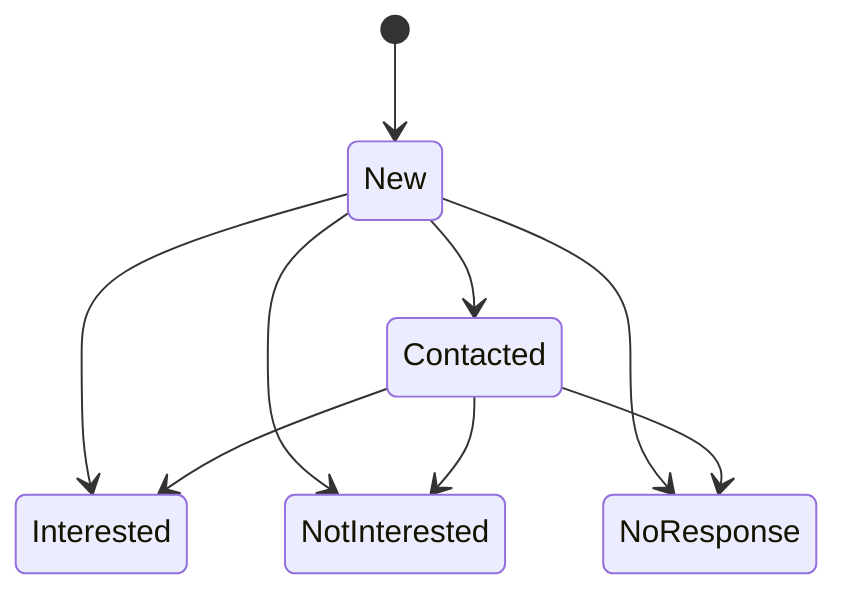
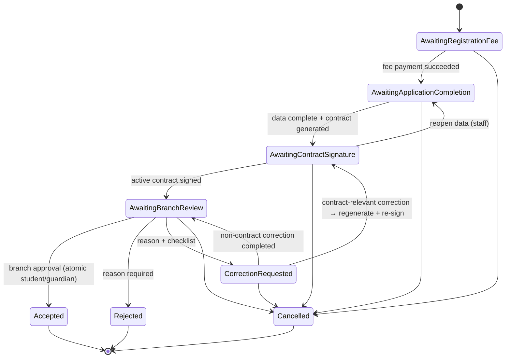
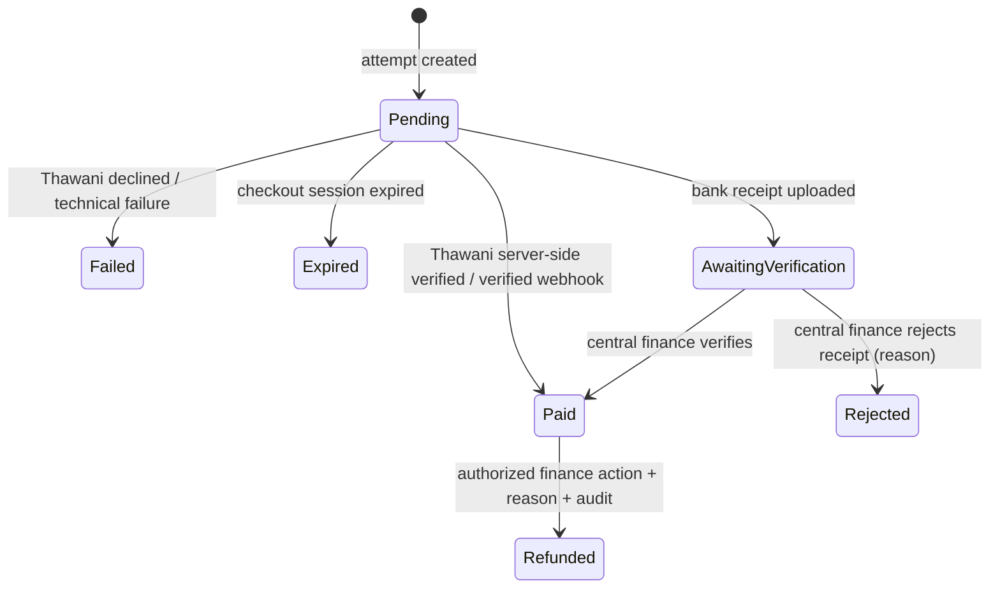
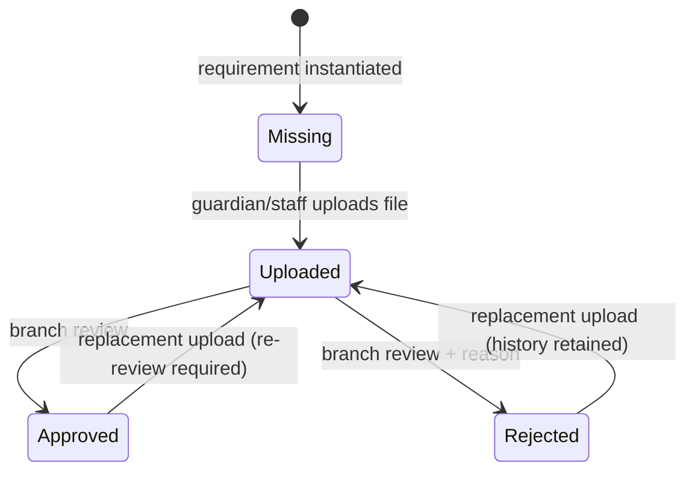
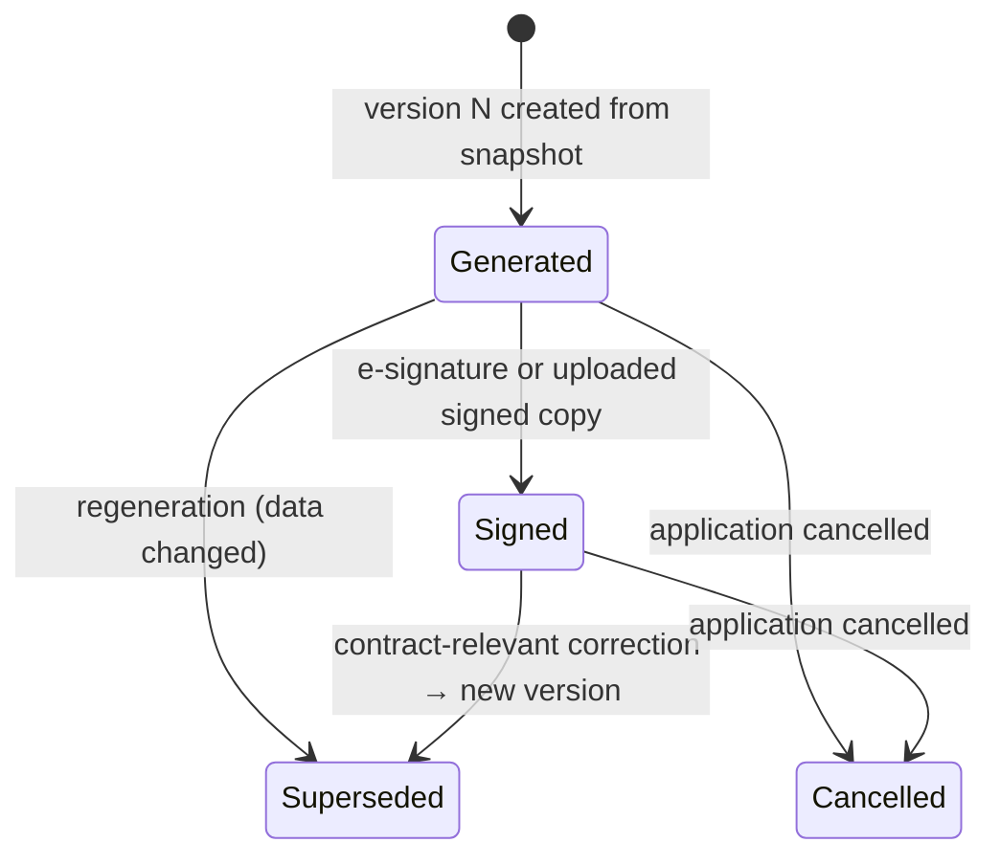

# Target Registration Architecture

Implementation-ready target architecture for the registration domain: lead, application, payment, document, and contract lifecycles. This document is the blueprint for the next implementation cycles. No production code changes in this cycle.

Legend used throughout:

- **[Confirmed]** — approved business requirement from the architecture brief. Do not change without stakeholder sign-off.
- **[Recommendation]** — technical proposal chosen by engineering; may be revisited during implementation review.

Evidence tiers (every schema claim below is tagged to exactly one tier; do not conflate them):

- **Repository migration schema** — what the migration files under `database/migrations/` produce on a fresh `migrate`. This is the only schema the repository controls and the only one fresh installs receive.
- **Reviewer-configured operational database** — a pre-existing `greader` database inspected directly with `php artisan db:table ...`. It was **not** built from the current migrations and **diverges** from them (§1.4). It is one real example of drift, **not** an authority for "no drift," and must never be called "live" to disprove drift.
- **Staging/production schema** — **unverified.** No staging or production database has been inspected in any cycle. Every reconciliation decision must be re-checked against it before feature migrations run (§9.4, §12).

Reviewer-verified operational facts (the reviewer-configured database, not a fresh install):

- **PHP 8.4.16 runs Laravel 13.4.0** and executes Artisan/schema inspection successfully. The earlier claim that the runtime was PHP 8.3.32 and blocked was **inaccurate** and is retracted.
- Which interpreter the bare `php` command resolves to is **host-specific and irrelevant to the architecture**; no machine-specific interpreter paths are recorded here (the earlier `C:\php84\...` notes are removed).
- **Database engine: MariaDB 10.11.15** (not MySQL). This matters: MariaDB's generated-column and functional-index behavior is not identical to MySQL 8, so the generated-column uniqueness proposals (§5.2, §5.5) are **unresolved**, not resolved, until tested on MariaDB 10.11.15 **and** on staging/production (§12). The previous "MySQL 8.4.3 resolves the generated-column concern" note was wrong on both the engine and the conclusion and is retracted.

Package versions confirmed from `composer.lock`: `spatie/laravel-model-states 2.13.1`, `spatie/laravel-permission 7.3.0`, `bezhansalleh/filament-shield 4.2.0`, `laravel/sanctum v4.3.1`, `laravel/framework v13.4.0`, `owen-it/laravel-auditing v14.0.3`, `spatie/laravel-webhook-server 3.10.0`, `carlos-meneses/laravel-mpdf 2.1.13`. The Laravel Boost MCP tools were not available in the authoring session; facts here were gathered via direct Artisan/schema inspection instead.

---

## 1. Current-state findings

Grounded in exact file paths on `develop` at commit `3bc0659`.

### 1.1 What exists and works

- Lead state machine: `app/States/Leads/LeadState.php` configures `new -> contacted`, and `new|contacted -> interested|not_interested|no_response` with transition classes under `app/States/Leads/Transitions/`. `ContactedLeadToInterested` validates program/branch availability, records a `lead_contacts` row, and calls `app/Actions/Applications/ConvertLeadToApplicationAction.php`.
- Application state machine: `app/States/Applications/ApplicationState.php` configures `draft -> submitted -> waiting_contract_signature -> under_review`, plus `waiting_contract_signature -> submitted`, and `draft|submitted -> cancelled`. State string values: `draft`, `submitted`, `waiting_contract_signature`, `under_review`, `accepted`, `rejected`, `cancelled`.
- Contract generation: `app/Actions/Applications/GenerateApplicationContractAction.php` runs inside `SubmittedToWaitingContractSignature` (`app/States/Applications/Transitions/SubmittedToWaitingContractSignature.php`), creating one `application_contracts` row per application with a 64-char token and 7-day expiry.
- Online signing: `routes/web.php` exposes `GET|POST /contract/{token}` via `app/Http/Controllers/ContractSigningController.php`, which delegates to `app/Actions/Applications/SignContractOnlineAction.php` (validates state + token, stores base64 PNG signature, generates a PDF via `app/Actions/Support/CreatePdfAction.php`, transitions to `under_review`).
- Activity trail: `app/Actions/Applications/RecordApplicationActivityAction.php` writes to `application_activities` (`database/migrations/2026_04_22_150757_create_application_activities_table.php`) from every transition class.
- Branch scoping: `app/Models/Scopes/BranchScope.php` filters `Lead`, `Application`, `Student` by `Auth::user()->branch_id` unless the user has the `super_admin` role or a null `branch_id`.
- Shield: policies exist for all major models under `app/Policies/` and use the Shield permission format `ViewAny:Application` (`config/filament-shield.php` — separator `:`, case `pascal`).
- Auditing: `owen-it/laravel-auditing` is installed; `User` and `Affiliate` are `Auditable`.
- Denormalized application schema: `database/migrations/2026_04_22_145705_create_applications_table.php` stores student, father, mother, and relative fields directly on `applications` with `lead_id` unique+nullable.

### 1.2 What does not exist yet

- No payment, invoice, refund, or fee tables/models/states of any kind. `app/Filament/Pages/PaymentPage.php`, `InvoicesPage.php`, and `AffiliatePaymentRequest.php` are placeholder pages.
- No application-document tables/models/states. There is no per-document upload or review capability.
- No contract versioning: `application_contracts` has `unique(application_id)` (`database/migrations/2026_05_02_132918_create_application_contracts_table.php`), so exactly one contract row can ever exist per application.
- No correction workflow: no reason/checklist storage; `app/Actions/Applications/ReturnApplicationForCorrectionAction.php` references a nonexistent `PendingRegistration` state.
- No settings mechanism for a configurable registration fee.
- No Sanctum abilities, idempotency, or rate limiting on the API: `routes/api.php` leaves every `/api/v1` endpoint public except `GET /api/v1/user`. `GET /api/v1/leads` publicly exposes lead PII (names, phone numbers).
- No domain events or outbox; outbound integration is two hard-coded webhook URLs in `config/services.php` with default secret `'secret'` and default-enabled flags pointing at production uchat URLs.

### 1.3 Authorization gaps

- `app/Models/User.php` — `canAccessPanel()` returns `true` for every authenticated user.
- `app/Models/Scopes/BranchScope.php` keys the bypass on the `super_admin` role name only, and silently disables scoping for any staff user whose `branch_id` is null.
- Several Filament actions rely only on `visible()` state checks (e.g. `app/Filament/Resources/Applications/Actions/UploadContractFilamentAction.php`) without a permission/policy check — exactly the "hidden actions as authorization" pattern the approved architecture forbids.

### 1.4 Three schema tiers: repository migrations, operational database, unverified production

Schema facts are separated into the three tiers defined in the evidence-tiers note above. **A freshly migrated database is not evidence about drift.** Building a database from the migrations and then observing that it matches the migrations is circular; the earlier "no drift on this machine" conclusion came from exactly that circular inspection and is retracted. The reviewer-configured operational database is a genuinely pre-existing database, and it **diverges from the repository migrations in both directions** — proving drift is real and must be reconciled, not assumed away.

**Tier 1 — Repository migration schema** (`database/migrations/2026_04_22_145705_create_applications_table.php`, verified by reading the file):

- `applications` defines **44 columns**, including `source` (`string` default `'website'`), `relationship_with_guardian` (`string` nullable), and `timestamps`; **no `rejection_reason`**.
- `lead_id` — `foreignId()->unique()->nullable()->constrained()->nullOnDelete()` → **nullable, unique, `ON DELETE SET NULL`**.
- `student_civil_number` — nullable `string`, with **no composite index**. Declared indexes: `ref_no` unique, `lead_id` unique, single-column `status`, single-column `student_gender`. **No `(student_civil_number, season_id)` index.**
- No `student_id` column (linkage to accepted students is added in §5.1 per correction 5).
- `season_id`, `program_id`, `branch_id` FKs are `restrictOnDelete`; `affiliate_id` and `lead_id` are `nullOnDelete`.

**Tier 2 — Reviewer-configured operational database** (`greader`, MariaDB 10.11.15, inspected with `php artisan db:table applications`). This database was **not** built from the current migrations and differs from Tier 1 on every point that matters here:

- `applications` has **43 columns**, reconciling exactly as *Tier 1 minus `source` and `relationship_with_guardian`, plus `rejection_reason`* (44 − 2 + 1 = 43).
- `lead_id` is **NOT NULL**, **unique**, and **`ON DELETE RESTRICT`** — already the §5.1 target, and the opposite of Tier 1's nullable / `SET NULL`.
- `(student_civil_number, season_id)` **already has a compound unique index.** Present here, absent in Tier 1 — so there *is* a real existing constraint to preserve (this corrects the earlier "verified absent" claim; see C12).
- `source` and `relationship_with_guardian` are **absent**, even though the model, DTOs, and Filament forms read/write them (`app/Models/Application.php`, `app/Filament/Resources/Applications/Schemas/ApplicationForm.php`, `app/DTOs/Application/CreateApplicationDTO.php`, and others) and the historical migration declares both. This is a runtime schema-vs-code hazard: any code path writing those columns fails against this database until reconciled.
- `rejection_reason` **exists** here but appears in no migration.

**Tier 3 — Staging/production schema — unverified.** Neither this cycle nor the previous one inspected a staging or production database. Tier 2 is one drifted example; it does **not** predict Tier 3. Every drift decision below is re-verified against Tier 3 (`php artisan db:table ...` / `schema:dump` diff) before any feature migration runs (§9.4, §12).

**Other tables (Tier 1 only; Tier 2/3 not re-inspected for these).**

- `application_contracts` (10 columns): `application_id` unique (`application_contracts_application_id_unique`) + FK **`ON DELETE CASCADE`**; `token` unique; no `version`/`status`/`data_snapshot` columns yet (added in §5.5).
- `students` (15 columns): `civil_number` nullable, **single-column unique** (`students_civil_number_unique`); `guardian_id`/`branch_id` FKs `ON DELETE RESTRICT`; no `season_id`/`program_id`/`application_id` columns (see correction 5 / §5.1).

#### Canonical reconciliation target

A reconciliation step precedes all feature migrations and brings **every** tier — fresh installs (Tier 1), the reviewer database (Tier 2), and staging/production (Tier 3, once inspected) — to one canonical baseline. Every operation is **guarded** (`Schema::hasColumn`, `Schema::hasIndex`, existence-checked FK/on-delete changes) so it is safe whether or not the target already matches, and **never raises a duplicate-column or duplicate-index error on any path**:

1. **`lead_id` NOT NULL + restricted FK.** Preserve where already `NOT NULL` / `ON DELETE RESTRICT` (Tier 2). Create it where the column is nullable / `SET NULL` (Tier 1), switching the FK to `restrictOnDelete` in the same change — a column cannot be both `NOT NULL` and `SET NULL`. Gated on a zero-`lead_id IS NULL` check (§9.4).
2. **`(student_civil_number, season_id)` compound unique index.** Preserve where present (Tier 2). Conditionally add where absent (Tier 1), only after the duplicate-pair check (§9.4) passes. `hasIndex`-guarded so it never fails on the tier that already has it.
3. **`source` and `relationship_with_guardian`.** Add safely (`hasColumn`-guarded) where absent (Tier 2), matching the historical definitions (`source` default `'website'`, `relationship_with_guardian` nullable); leave untouched where present (Tier 1). This closes the schema-vs-code hazard identified in Tier 2.
4. **`rejection_reason`.** Preserve where present (Tier 2). Conditionally add (nullable `text`, `hasColumn`-guarded) where absent (Tier 1), so `AwaitingBranchReview -> Rejected` (§4.1) has its storage on every tier.
5. **Generated-column uniqueness (`paid_uniqueness`, `active_uniqueness`).** **Unresolved** until tested on MariaDB 10.11.15 **and** staging/production — MariaDB's generated-column and unique-index semantics are not assumed equal to MySQL 8's. Until that test passes, the application-level locking fallback (§5.2, §5.5) is the default and no generated-column unique index is relied upon.
6. Reconcile only through **additive corrective migrations** (`add_*`/`change_*`), never by editing historical migration files (they must keep producing the Tier 1 baseline for fresh installs). Fresh installs run historical + corrective; existing databases run only the not-yet-applied corrective migrations; all converge on an identical final schema, verified by diffing `schema:dump` between a fresh install and a migrated existing copy in CI.

---

## 2. Conflicts: schema vs. code, missing and stale classes

These are current defects, verified in the working tree. They must be fixed or deleted before the target machines are built, because several would fatal at runtime.

| # | File | Problem |
|---|------|---------|
| C1 | `app/Actions/Applications/AcceptApplicationAction.php` | Imports and uses `App\Models\ApplicationStudent`, `App\Models\ApplicationContact`, and `$application->applicationStudent`/`contacts` relations. None of those classes, relations, or tables exist. `UnderReviewToAccepted` would fatal if ever executed. |
| C2 | `app/States/Applications/ApplicationState.php:29-30` | `UnderReview -> Accepted` and `UnderReview -> Rejected` transitions are commented out, while `AcceptApplicationFilamentAction` / `RejectApplicationFilamentAction` gate visibility on `canTransitionTo(...)` — so accept/reject is currently unreachable from the UI. |
| C3 | `app/States/Applications/ApplicationState.php:11` | Imports `WaitingContractSignatureToCancelled`, which does not exist in `app/States/Applications/Transitions/`. Unused import today, fatal the moment it is wired into `config()`. |
| C4 | `app/Actions/Applications/SendContractAction.php` | References nonexistent state `App\States\Applications\WaitingContract`, nonexistent column `$application->contract_token` (tokens live on `application_contracts.token`), and undefined config `services.webhooks.contract.*`. The corresponding Filament action (`SendContractFilamentAction.php`) is permanently `disabled()` with an empty action body. |
| C5 | `app/Actions/Applications/UploadSignedContractAction.php` | Also references nonexistent `WaitingContract`. The live upload path is inlined in `app/Filament/Resources/Applications/Actions/UploadContractFilamentAction.php` instead. |
| C6 | `app/Actions/Applications/ReturnApplicationForCorrectionAction.php` | References nonexistent state `App\States\Applications\PendingRegistration`. |
| C7 | `app/States/Applications/Transitions/DraftToSubmitted.php` | Imports nonexistent `App\Actions\Applications\ValidateApplicationCompletionAction`; calls `$this->data->toArray()` on a nullable DTO, so a transition without a DTO throws a null error. No completion validation actually runs. |
| C8 | `database/factories/ApplicationFactory.php` | `configure()` uses nonexistent `applicationStudent()`/`contacts()` relations and nonexistent enum `App\Enums\ContactType`. Every `Application::factory()->create()` fatals, which breaks the whole of `tests/Feature/ApplicationWorkflowTest.php`. |
| C9 | `tests/Feature/ApplicationWorkflowTest.php` | Asserts behavior that does not exist: completion validation on submit, signed-contract validation before review (`WaitingContractSignatureToUnderReview` performs no such check), `applicationStudent` access, accept/reject transitions (disabled per C2). |
| C10 | `app/Models/Student.php` | `applications()` is a `HasManyThrough` via nonexistent `ApplicationStudent`. Fatal when called. |
| C11 | `routes/api.php` | Registers `POST /api/v1/leads/{lead}/transition`, but `app/Http/Controllers/Api/V1/LeadController.php` defines no `transition` method → 500 on call. |
| C12 | `docs/data-model.md` / `applications` | Claims a unique constraint on `student_civil_number + season_id`. This is **absent from the repository migrations (Tier 1)** but **present in the reviewer-configured operational database (Tier 2)** (§1.4). So it is a *real, existing* constraint to **preserve** on drifted databases and to **conditionally add** on fresh installs (§5.1) — not, as an earlier draft claimed, uniformly absent. It is on `applications` (student civil number + season), separate from the single-column `students.civil_number` unique. |
| C13 | `app/Models/Application.php:110-121` | `ref_no` is generated as `count()+1`, not concurrency-safe; two simultaneous creates can collide on the unique index. |
| C14 | `app/Http/Controllers/ContractSigningController.php` | `show()` checks `isSigned()` but not token expiry, so an expired unsigned contract still renders; `sign()` checks expiry but not `isSigned()`, relying on the action's state check. Also duplicates guardian-name logic inconsistently between `show()` and `sign()` (sign ignores `relative_*` guardians). |
| C15 | `app/Actions/Support/CreatePdfAction.php` usage in `SignContractOnlineAction` | Contract PDFs are written to `pdfs/contracts/{time()}.pdf` — same-second signings overwrite each other. |
| C16 | `config/services.php` | Webhooks enabled by default with hard-coded production uchat URLs and default secret `'secret'`. |

Decision required before implementation: C1/C8/C9/C10 mean the split-model design (`ApplicationStudent`/`ApplicationContact`) is dead code. **[Recommendation]** Standardize on the current denormalized `applications` schema (matching the live migrations and Filament forms) and rewrite the accept action, factory, tests, and `Student::applications()` accordingly. The target design below assumes this.

---

## 3. Target lifecycles

Five separate Spatie state machines **[Confirmed]**. Namespaces follow existing convention `app/States/<Domain>/`.

### 3.1 Lead lifecycle (unchanged states)

The existing lead machine is kept as-is **[Confirmed: leads remain a separate lifecycle]**. States: `new`, `contacted`, `interested`, `not_interested`, `no_response`.



Transition matrix:

| From \ To | Contacted | Interested | NotInterested | NoResponse |
|---|---|---|---|---|
| New | ✔ | ✔ | ✔ | ✔ |
| Contacted | — | ✔ | ✔ | ✔ |
| Interested / NotInterested / NoResponse | terminal in current design | | | |

Changes to the `Interested` transition: instead of creating a `draft` application, `ContactedLeadToInterested` (and the new manual-entry path) creates an application in `AwaitingRegistrationFee`. Every formal application originates from a lead **[Confirmed]**; manual staff entry in Filament creates the lead and the application in one DB transaction **[Confirmed]** (new `CreateLeadWithApplicationAction` wrapping `CreateLeadAction` + `CreateApplicationAction` in `DB::transaction`).

**[Recommendation]** Do not add a `Converted` lead state in this release; `leads.id` ↔ `applications.lead_id` (unique) already expresses conversion, and adding states would complicate the migration.

### 3.2 Application lifecycle

Approved states **[Confirmed]**: `AwaitingRegistrationFee`, `AwaitingApplicationCompletion`, `AwaitingContractSignature`, `AwaitingBranchReview`, `CorrectionRequested`, `Accepted`, `Rejected`, `Cancelled`.

Approved sequence **[Confirmed]**: payment confirmation → data completion → contract generation → signature → branch review → acceptance or rejection.



State string values **[Recommendation]** (snake_case, matching existing convention): `awaiting_registration_fee`, `awaiting_application_completion`, `awaiting_contract_signature`, `awaiting_branch_review`, `correction_requested`, `accepted`, `rejected`, `cancelled`.

Transition matrix (✔ allowed; blank = disallowed):

| From \ To | AwaitFee | AwaitCompletion | AwaitSignature | AwaitBranchReview | CorrectionReq | Accepted | Rejected | Cancelled |
|---|---|---|---|---|---|---|---|---|
| AwaitingRegistrationFee | — | ✔ | | | | | | ✔ |
| AwaitingApplicationCompletion | | — | ✔ | | | | | ✔ |
| AwaitingContractSignature | | ✔ | — | ✔ | | | | ✔ |
| AwaitingBranchReview | | | | — | ✔ | ✔ | ✔ | ✔ |
| CorrectionRequested | | | ✔ | ✔ | — | | | ✔ |
| Accepted | | | | | | terminal | | |
| Rejected | | | | | | | terminal | |
| Cancelled | | | | | | | | terminal |

Notes:

- `AwaitingContractSignature -> AwaitingApplicationCompletion` **[Recommendation]** replaces the current `waiting_contract_signature -> submitted` back-edge so staff can reopen data entry before signing; it must mark the generated contract `Superseded` (see 3.5) if one exists.
- `CorrectionRequested -> AwaitingContractSignature` applies only when the correction is contract-relevant **[Confirmed]**; non-contract corrections return directly to `AwaitingBranchReview` **[Confirmed]**.
- Rejected is terminal in the first release. **[Recommendation]** If re-application is needed, a new lead/application is created; do not add a `Rejected -> AwaitingBranchReview` edge without business sign-off.

### 3.3 Payment lifecycle (registration fee)

Methods in first release: `Thawani`, `BankTransfer` only — no cash **[Confirmed]**.

States **[Recommendation, satisfying confirmed rules]**: `pending`, `awaiting_verification`, `paid`, `failed`, `rejected`, `expired`, `refunded`. **`failed`** and **`rejected`** are distinct **[correction 7]**: `failed` = Thawani/provider decline or a technical/verification error (no human decision); `rejected` = central finance deliberately rejecting a bank-transfer receipt (a human decision, reason required).



Transition matrix:

| From \ To | AwaitingVerification | Paid | Failed | Rejected | Expired | Refunded |
|---|---|---|---|---|---|---|
| Pending | ✔ (bank transfer only) | ✔ (Thawani only) | ✔ (Thawani/technical) | | ✔ (Thawani only) | |
| AwaitingVerification | — | ✔ | | ✔ (finance decision) | | |
| Paid | | — | | | | ✔ |
| Failed / Rejected / Expired / Refunded | terminal | | | | | |

Rules baked into guards:

- Thawani payments reach `paid` **only** after server-side verification of the checkout session or verified webhook processing — never from a client redirect alone **[Confirmed]**.
- Bank transfers require a receipt upload (→ `awaiting_verification`) and central-finance verification (→ `paid`) **[Confirmed]**.
- Multiple attempts per application are allowed, but at most one `paid` registration-fee payment satisfies the application **[Confirmed]** — enforced by DB constraint (§5.2) and by the `PendingToPaid` / `AwaitingVerificationToPaid` transitions locking the application row.
- `Paid -> Refunded` is manual only: requires the `Refund:Payment` permission, a reason, and an audit entry **[Confirmed]**. No automated refund calls to Thawani in this release **[Confirmed]**; the record marks the refund as performed externally.
- A payment reaching `paid` fires the application transition `AwaitingRegistrationFee -> AwaitingApplicationCompletion` inside the same DB transaction (side effect of the payment transition, not a separate step, so partial success is impossible).

### 3.4 Document lifecycle

States **[Confirmed]**: `missing`, `uploaded`, `approved`, `rejected`.



Transition matrix:

| From \ To | Uploaded | Approved | Rejected |
|---|---|---|---|
| Missing | ✔ | | |
| Uploaded | — (replace = new file version, stays Uploaded) | ✔ | ✔ |
| Rejected | ✔ | | |
| Approved | ✔ (re-upload voids approval) | — | |

Rules:

- Branches review documents **[Confirmed]** — approval/rejection requires `Review:ApplicationDocument` and branch match.
- **Confirmed required types [correction 6]**: birth certificate, student civil ID **or** passport (alternative pair, §5.4), personal photo, transfer file (conditional), vaccination card, mother ID, father ID, and medical examination card.
- Missing documents **warn but do not block** contract generation in the first release **[Confirmed]**. The gate on `AwaitingApplicationCompletion -> AwaitingContractSignature` checks required application **data** (including `student_civil_number`) **[Confirmed]**, not document states — so an application with missing/unapproved documents can still generate and sign a contract in v1.
- The transfer file is required only when the student transfers from another school **[Confirmed]** — modeled as a conditional requirement keyed on a new `applications.is_transfer_student` boolean (§5.4). How this flag is captured in the form is an open input (§12).
- Replacement retains history **[Confirmed]**: every upload creates an `application_document_files` row; the document points at the current file, prior rows are never deleted.

### 3.5 Contract lifecycle

States **[Confirmed]**: `generated`, `signed`, `superseded`, `cancelled`. Contracts are versioned **[Confirmed]**.



Transition matrix:

| From \ To | Signed | Superseded | Cancelled |
|---|---|---|---|
| Generated | ✔ | ✔ | ✔ |
| Signed | — | ✔ | ✔ |
| Superseded / Cancelled | terminal | | |

Rules:

- Both electronic signatures (existing `/contract/{token}` flow) and staff upload of signed copies are supported **[Confirmed]**; both drive `Generated -> Signed` on the **active** (highest-version, non-superseded) contract.
- Generation is gated by required application data including `student_civil_number` **[Confirmed]** — a `ValidateApplicationCompletionAction` (real this time; see C7) runs before generation.
- Each version stores, immutably: (a) `data_snapshot` — the resolved variable set; (b) `rendered_body` — the **fully resolved contract text as the signer saw it**; and (c) `template_hash` — a hash of the source `programs.contract` template at generation time. **[Confirmed minimum + Recommendation]** Together these define "contract-relevant" for correction classification (§6) and guarantee that later global template edits never silently alter an already-signed contract.
- **Confirmed minimum contract-relevant set** (always compared, independent of the current template's placeholders): student legal name, student civil number, guardian legal name and guardian identity (ID number), branch, program, and the contract terms/body — plus every other value printed into the contract **[Confirmed, correction 3]**.
- Acceptance (`AwaitingBranchReview -> Accepted`) requires the active contract to be `signed`, then atomically creates/updates guardian and student records and records the approver in `application_activities` **[Confirmed]** — single `DB::transaction` in the transition class, replacing the broken `AcceptApplicationAction` (C1).

---

## 4. Guards, actors, permissions, side effects, audit

Shield permission names use the project's configured format (`config/filament-shield.php`: separator `:`, PascalCase). Roles aggregate permissions **[Confirmed]**; suggested roles: `super_admin`, `branch_staff`, `branch_manager`, `central_finance`, `service_fasih` (Sanctum-only, no panel). Authorization must be enforced in policies/actions via `authorize()`, never only via Filament `visible()` **[Confirmed]**.

### 4.1 Application transitions

| Transition | Actor | Permission | Guards | Side effects | Audit |
|---|---|---|---|---|---|
| (create) Lead → AwaitingRegistrationFee | System (lead interested) or branch staff (manual entry) | `Create:Application` | Lead exists; program available in branch; season active; unique `lead_id` | Lead+application created transactionally on manual entry | `application_activities` row `-> awaiting_registration_fee`; owen-it audit |
| AwaitingRegistrationFee → AwaitingApplicationCompletion | System (payment transition side effect) | none directly (driven by payment perms) | Exactly one `paid` registration-fee payment for this application | none beyond state | Activity row referencing payment id in notes |
| AwaitingApplicationCompletion → AwaitingContractSignature | Branch staff | `GenerateContract:Application` | `ValidateApplicationCompletionAction` passes (incl. `student_civil_number`, guardian resolution); branch match | New contract version `generated` with data snapshot + token; missing-document warning surfaced (non-blocking) | Activity row; contract row is itself the record |
| AwaitingContractSignature → AwaitingBranchReview | Public signer (token) or branch staff (upload) | token possession / `UploadSignedContract:Application` | Active contract exists, token valid+unexpired (online), file provided (upload); contract transitions `generated -> signed` in same transaction | Signature/file stored; PDF generated (unique filename, fix C15) | Activity row + contract fields (`signed_at`, `signed_by_applicant`) |
| AwaitingContractSignature → AwaitingApplicationCompletion | Branch staff | `Update:Application` | Active contract not signed | Active contract → `superseded` | Activity row with reason note |
| AwaitingBranchReview → CorrectionRequested | Branch staff | `RequestCorrection:Application` | Reason + checklist provided | `application_corrections` row created (open) | Activity row + correction row **[Confirmed: reason, checklist, requesting user, timestamp, activity entry]** |
| CorrectionRequested → AwaitingBranchReview | Branch staff | `Update:Application` | Open correction is non-contract-relevant and marked completed | Correction closed (`completed_by`, `completed_at`) | Activity row |
| CorrectionRequested → AwaitingContractSignature | Branch staff | `GenerateContract:Application` | Open correction is contract-relevant and completed; completion re-validated | Signed contract → `superseded`; new version `generated`; new token | Activity row; both contract versions retained |
| AwaitingBranchReview → Accepted | Branch staff/manager | `Accept:Application` | Active contract `signed`; branch match; completion valid | Guardian + student created/updated atomically; `applications.student_id` back-linked in same transaction; contact rows synced; outbox event `application.accepted` | Activity row with approver (`transitioned_by`) **[Confirmed]** |
| AwaitingBranchReview → Rejected | Branch staff/manager | `Reject:Application` | Rejection reason required | `rejection_reason` stored; outbox event | Activity row with reason |
| any non-terminal → Cancelled | Branch staff (own branch) / super admin | `Cancel:Application` | Not `accepted`/`rejected`; note required | Active contract (if any) → `cancelled`; pending payments → no change (attempts remain) | Activity row |

### 4.2 Payment transitions

| Transition | Actor | Permission | Guards | Side effects | Audit |
|---|---|---|---|---|---|
| (create attempt) | Guardian via API/portal, or branch staff | `Create:Payment` (staff) / Sanctum ability `payments:initiate` (service) | Application in `awaiting_registration_fee`; amount = global registration fee setting; idempotency key unused | Thawani checkout session created via adapter (Thawani method) | Payment row is the record; owen-it audit on Payment |
| Pending → Paid (Thawani) | System (verification callback/command) | none (server-side only) | Thawani session verified server-side or webhook signature verified **[Confirmed]**; no other `paid` payment exists for application (row lock) | Application → `awaiting_application_completion` in same transaction | Activity row on application; `payments.verified_at`, provider payload snapshot |
| Pending → AwaitingVerification (bank) | Guardian/staff uploads receipt | `Update:Payment` or ability `payments:upload-receipt` | Receipt file present | — | receipt file row |
| AwaitingVerification → Paid | Central finance | `VerifyBankTransfer:Payment` (cross-branch via `ViewAllBranches:Payment`; §7) | Receipt exists; no other `paid` payment (row lock) | Application → `awaiting_application_completion` | `verified_by`, `verified_at`, activity row |
| AwaitingVerification → Rejected | Central finance | `VerifyBankTransfer:Payment` | Reason required (human decision; distinct from `failed`) | — | `rejected_by`, `rejected_at`, reason stored |
| Pending → Failed/Expired | System | none | Provider decline / technical error / TTL (no human decision) | — | provider payload |
| Paid → Refunded | Central finance | `Refund:Payment` | Reason required; refund executed externally (no automation) **[Confirmed]** | Application state unchanged automatically (staff decide follow-up: cancel or new payment) **[Recommendation]** | `refunded_by`, `refund_reason`, `refunded_at`, audit entry **[Confirmed]** |

### 4.3 Document transitions

| Transition | Actor | Permission | Guards | Side effects | Audit |
|---|---|---|---|---|---|
| Missing → Uploaded | Guardian (token/API ability) or branch staff | `Upload:ApplicationDocument` / ability `documents:upload` | File type/size valid | `application_document_files` row (version 1) | file row + owen-it audit |
| Uploaded → Approved | Branch staff | `Review:ApplicationDocument` | Branch match | — | `reviewed_by/at` |
| Uploaded → Rejected | Branch staff | `Review:ApplicationDocument` | Reason required | — | reason stored |
| Rejected/Approved → Uploaded (replace) | Guardian/staff | as upload | Prior files retained **[Confirmed]** | New `application_document_files` row; `current_file_id` repointed; status reset to `uploaded` | full file history |

### 4.4 Contract transitions

| Transition | Actor | Permission | Guards | Side effects | Audit |
|---|---|---|---|---|---|
| (generate vN) | Branch staff | `GenerateContract:Application` | Completion validation passes; any active version superseded first | Token + expiry + data snapshot | contract row |
| Generated → Signed | Public signer / staff upload | token / `UploadSignedContract:Application` | Token unexpired (online); active version only | Signature or file stored; application → `awaiting_branch_review` | `signed_at`, `signed_by_applicant`, activity |
| Generated/Signed → Superseded | System (correction/regeneration) | via driving action's permission | Newer version being generated | — | `superseded_at`, link to successor |
| Generated/Signed → Cancelled | System (application cancelled) | via `Cancel:Application` | — | — | activity |

---

## 5. Proposed persistence model

All new tables use `php artisan make:migration`, `foreignId()->constrained()`, and follow existing naming. Existing tables are altered, not replaced.

### 5.1 `applications` (alter)

- Add `is_transfer_student` boolean default false (drives transfer-file requirement).
- Add **`student_id`** nullable FK → `students.id`, `nullOnDelete` **[Confirmed intent, correction 5]**. It is populated **atomically during acceptance** (inside the `AwaitingBranchReview -> Accepted` transaction, §4.1 / §5.9), right after the student is created/updated. This column — not a civil-number join — is the canonical Application↔Student link. `app/Models/Student.php::applications()` becomes a plain `hasMany(Application::class)` on `student_id`, and `Application::student()` a `belongsTo(Student::class)`. This replaces the broken `HasManyThrough`-via-`ApplicationStudent` relation (C10) and removes the fragile civil-number join suggested in an earlier draft.
- For this release, the accepted application **records the student's branch, program, and season directly on the application row** (existing `branch_id`, `program_id`, `season_id` columns). Students are not given their own season/program columns in this cycle; the application row is the system of record for "which branch/program/season this student was accepted under." **[Confirmed intent, correction 5]**
- Keep `status` string (state machine handles values); migrate values per §9.
- Keep `lead_id` unique — one application per lead **[Confirmed: every application originates from a lead]**. Manual entry always creates the lead first, so `lead_id` must be **NOT NULL** with a restricted FK. This is **already the case in the operational database** (NOT NULL / `ON DELETE RESTRICT`, §1.4 Tier 2) and must be **preserved** there; on the repository/fresh schema (nullable / `ON DELETE SET NULL`, Tier 1) the corrective migration **creates** it, switching the FK to `restrictOnDelete` in the same change (a `NOT NULL` column cannot be `SET NULL`). Both paths are guarded and gated on a zero-`lead_id IS NULL` check (§9.4, §12).
- Unique composite `(student_civil_number, season_id)` (nullable-safe: multiple NULLs allowed). This constraint **already exists in the operational database** (§1.4 Tier 2) — **preserve** it there — and is **absent from the repository migrations** (Tier 1) — **conditionally add** it there after the duplicate-pair check (§9.4). The corrective migration is `hasIndex`-guarded so it never fails on the tier that already has it. (Corrects the earlier "verified absent" claim, C12.)
- Reconcile the drifted columns via the guarded §1.4 step so the flat-schema forms and the reject flow work on every tier: ensure `source` and `relationship_with_guardian` exist (present in Tier 1, **absent in Tier 2**) and `rejection_reason` exists (**absent in Tier 1**, present in Tier 2). Each is `hasColumn`-guarded.
- Fix `ref_no` generation (C13): use a `DB::transaction` + `lockForUpdate()` on a per-year counter row (new `reference_counters` table: `key` unique, `value`) — same pattern should back `LeadRefNoGenerator` eventually.

### 5.2 `payments` (new)

| Column | Notes |
|---|---|
| `id`, `timestamps` | |
| `application_id` FK → applications, cascadeOnDelete | |
| `branch_id` FK (denormalized from application) | enables BranchScope + finance reporting |
| `purpose` string, default `registration_fee` | future-proof, single purpose in v1 |
| `method` string | `thawani` \| `bank_transfer` |
| `status` string, index | state machine |
| `amount` decimal(10,3), `currency` char(3) default `OMR` | Thawani uses baisa; adapter converts |
| `idempotency_key` string nullable unique | client-supplied attempt key |
| `provider_session_id` string nullable unique | Thawani checkout session |
| `provider_payload` json nullable | verification/webhook snapshot |
| `receipt_path` string nullable | bank transfer receipt |
| `verified_by` FK users nullable, `verified_at` | central finance |
| `failed_reason` text nullable | provider/technical failure detail (`failed` state) |
| `rejected_by` FK users nullable, `rejected_reason` text nullable, `rejected_at` | central finance receipt rejection (`rejected` state; distinct from `failed`) **[correction 7]** |
| `refunded_by` FK users nullable, `refund_reason` text nullable, `refunded_at` | |
| `paid_uniqueness` (stored generated column) | `= application_id when status='paid' and purpose='registration_fee', else NULL`; **unique index** intended to enforce "one successful registration-fee payment per application" at DB level **[Recommendation — generated-column uniqueness is UNRESOLVED on MariaDB 10.11.15 (§1.4 item 5, §12 blocker 2); test on MariaDB 10.11.15 and staging/production before relying on it, otherwise the application-level row lock in `PendingToPaid`/`AwaitingVerificationToPaid` is the enforcement mechanism]** |

Indexes: (`application_id`, `status`), (`branch_id`, `status`), `provider_session_id` unique, `idempotency_key` unique.

Model: `App\Models\Payment`, `#[ScopedBy(BranchScope::class)]`, states under `app/States/Payments/`, `Auditable`.

### 5.3 `settings` (new, minimal)

`key` string unique, `value` json, timestamps. Single seeded key `registration_fee_amount` **[Confirmed: configurable global value in first release]**. **[Recommendation]** Plain table + cached accessor class (`app/Support/Settings.php`); avoids adding `spatie/laravel-settings` as a new dependency.

### 5.4 `application_documents` + `application_document_files` (new)

`application_documents`:

- `application_id` FK, `branch_id` FK (denormalized), `type` string (enum `App\Enums\DocumentType`), `status` string index (`missing|uploaded|approved|rejected`), `is_required` boolean, `requirement_group` string nullable, `current_file_id` FK nullable → `application_document_files`, `reviewed_by` FK users nullable, `reviewed_at`, `rejection_reason` text nullable, timestamps.
- Unique (`application_id`, `type`).
- **Confirmed document types [correction 6]** for `App\Enums\DocumentType`: `birth_certificate`, `student_civil_id`, `passport`, `personal_photo`, `transfer_file`, `vaccination_card`, `mother_id`, `father_id`, `medical_examination_card`.
- **Alternative requirement (civil ID OR passport) [Confirmed, correction 6]**: `student_civil_id` and `passport` share `requirement_group = 'student_identity'`. The group is satisfied when **any one** member reaches `approved` (or `uploaded`, per the non-blocking rule). Requirement completeness is evaluated per group, not per row, so a student with an approved passport is not flagged for a missing civil ID and vice-versa.
- **`transfer_file` remains conditional [Confirmed]** on `applications.is_transfer_student`; it is instantiated as a required `missing` row only for transfer students.

`application_document_files`:

- `application_document_id` FK cascade, `file_path`, `original_name`, `mime_type`, `size`, `uploaded_by_type`/`uploaded_by_id` nullable morph (staff user vs guardian/public), `uploaded_at`, timestamps. Rows are append-only **[Confirmed: replacement retains history]**.

Requirement instantiation: when an application enters `awaiting_application_completion`, a `SyncRequiredDocumentsAction` creates `missing` rows for each required type; `transfer_file` only when `is_transfer_student` **[Confirmed]**.

### 5.5 `application_contracts` (alter → versioned)

- Drop unique on `application_id` alone.
- Add: `version` unsignedInteger, `status` string index (`generated|signed|superseded|cancelled`), `data_snapshot` json (resolved variable set), `rendered_body` longText (**immutable** fully-resolved contract text as signed), `template_hash` string (hash of the source `programs.contract` template at generation), `generated_by` FK users nullable, `superseded_at` timestamp nullable, `superseded_by_contract_id` FK nullable self-reference. **[Confirmed minimum: contract-relevant = every printed value; correction 3]** The `rendered_body`/`template_hash` pair is never updated after generation — a template edited later produces a *new* version only via an explicit regeneration, never by mutating an existing row.
- Unique (`application_id`, `version`).
- One-active-version invariant: stored generated column `active_uniqueness = application_id when status in ('generated','signed') else NULL` with unique index **[Recommendation]** (same unresolved-generated-column caveat as §5.2 — must be verified on MariaDB 10.11.15 before use, §12 blocker 2); the application-level check in `GenerateApplicationContractAction` is the guaranteed enforcement and the fallback if the index is not viable.
- Backfill (§9): existing rows become `version = 1`, status derived from `signed_at`.

### 5.6 `application_corrections` (new)

- `application_id` FK, `requested_by` FK users, `reason` text, `checklist` json (array of `{item: string, done: bool}`), `is_contract_relevant` boolean, `requested_at`, `completed_by` FK users nullable, `completed_at` nullable, timestamps.
- Index (`application_id`, `completed_at`). At most one open correction per application enforced in the action (query for `completed_at IS NULL`) **[Recommendation]**.

### 5.7 `outbox_messages` (new)

- `id`, `event_type` string index (e.g. `application.accepted`, `payment.paid`, `correction.requested`), `aggregate_type`, `aggregate_id`, `payload` json, `status` string index (`pending|processed|failed`), `attempts` unsignedTinyInt, `processed_at` nullable, timestamps.
- Written inside the same transaction as the domain change; a future queued worker delivers notifications/webhooks. **No external calls implemented this cycle** **[Confirmed]**. Existing `spatie/laravel-webhook-server` can be the delivery mechanism later.

### 5.8 `api_idempotency_keys` (new)

- `key` string unique, `token_id` FK personal_access_tokens nullable, `request_hash` string, `response_status` smallint, `response_body` json, `expires_at`, timestamps. Middleware-backed idempotent replay for the Fasih API (§8).

### 5.9 Entity relationships (summary)

```text
Lead 1—0..1 Application (applications.lead_id unique, NOT NULL target)
Application *—0..1 Student (applications.student_id nullable FK; set atomically on acceptance)
Student 1—* Application (Student::applications() = hasMany on student_id)
Application 1—* Payment
Application 1—* ApplicationContract (versions; ≤1 active)
Application 1—* ApplicationDocument 1—* ApplicationDocumentFile
Application 1—* ApplicationCorrection
Application 1—* ApplicationActivity
Application —> Guardian/Student created/updated on acceptance (students.civil_number unique); student_id back-linked in same transaction
```

---

## 6. Contract versioning and correction classification

### 6.1 Versioning

- The contract template lives on `programs.contract` (unchanged). Generation resolves the template + variables and stores, immutably, the resolved variable set (`data_snapshot`), the fully-resolved body (`rendered_body`), and the source template hash (`template_hash`) at generation time. Rendering (web + PDF) always uses the stored `rendered_body`, never live application data or the live template — this makes old versions reproducible and makes "what the signer saw" auditable.
- **Template edits do not touch already-generated or signed contracts.** Because each version pins its own `rendered_body` + `template_hash`, an admin editing `programs.contract` later has zero effect on existing versions. A changed template only matters the next time a version is *explicitly* generated (new application, or regeneration after a contract-relevant correction). This is the mechanism that prevents "silent" application of global template edits to signed contracts.
- Only one version may be `generated` or `signed` at a time. Regeneration supersedes the current version and increments `version`.

### 6.2 Correction classification

**[Confirmed]** Contract-relevant data = every value printed in the contract, and **at minimum** the confirmed set: student legal name, student civil number, guardian legal name and guardian identity, branch, program, and contract terms/body (correction 3). Relevance is **not** derived only from the current template's placeholders — the confirmed minimum set is always compared even if a template omits a field, and a change to the contract terms/template itself (detected via `template_hash`) is contract-relevant on its own. Classification is computed, not hand-picked:

1. `CorrectionRequested` is entered with reason + checklist. A `data_before` snapshot of the confirmed-minimum fields (plus any current template variables) feeding the contract is captured on the correction row (`data_before` json column on `application_corrections`, §5.6) **[Recommendation]**.
2. When staff mark the correction complete, `ClassifyCorrectionAction` recomputes (a) the confirmed-minimum field set and (b) the resolved contract body from current application + current template, then diffs both against the signed version's `data_snapshot` **and** `rendered_body`/`template_hash`.
3. Any difference in the confirmed-minimum set, the resolved body, or the template hash → contract-relevant: signed contract → `superseded`, new version generated, application → `awaiting_contract_signature` (new signature required) **[Confirmed]**.
4. No difference → application returns directly to `awaiting_branch_review` **[Confirmed]**.
5. `is_contract_relevant` on the correction row records the outcome for reporting.

This anchors relevance to a confirmed field set (not just whatever placeholders a template happens to contain), keeps already-signed contracts immune to later template edits, and still catches every printed-value change.

---

## 7. Branch isolation and centralized finance

**[Confirmed]** Operational branch users are restricted to their own branch; central finance operates across all branches; Shield permissions are the mechanism; roles aggregate permissions; do not rely on hidden Filament actions.

Design principle **[Confirmed, correction 4]**: central finance is **not** given a blanket global bypass over every branch-owned model. Cross-branch access is granted **per model**, so finance can see payments everywhere but does not thereby gain all-branch visibility of leads, students, documents, etc. Branch operational users remain strictly limited to their own branch.

1. **Model-specific cross-branch permissions.** Rework `app/Models/Scopes/BranchScope.php` so the bypass is keyed on the concrete model. For a model `X`, a user sees all branches only if they have `super_admin` (a genuine, intentional global) **or** the model-scoped permission `ViewAllBranches:{X}` (e.g. `ViewAllBranches:Payment`). Implementation: the scope resolves the model's Shield resource name and checks `$user->can("ViewAllBranches:{$resource}")`; no single global flag grants everything except `super_admin`. **[Recommendation]** Also close the current hole where `branch_id IS NULL` disables scoping — a user who is neither `super_admin` nor holder of the relevant `ViewAllBranches:{X}` and who has no `branch_id` should see nothing (`whereRaw('1=0')`), not everything.
2. **Scope coverage.** Apply `BranchScope` to `Payment` and `ApplicationDocument` (both carry a denormalized `branch_id` for exactly this purpose). `ApplicationContract`, `ApplicationCorrection`, and `ApplicationActivity` are only reachable through their application (relation managers / nested queries), which is already scoped; their policies must still verify `$record->application->branch_id` against the user.
3. **Policy record checks.** Every policy `view/update/delete/…($user, $record)` must check branch ownership in addition to the Shield permission, using the **model-specific** cross-branch permission: e.g. `$user->can('Update:Application') && ($user->hasRole('super_admin') || $user->can('ViewAllBranches:Application') || $user->branch_id === $record->branch_id)`. Current policies (e.g. `app/Policies/ApplicationPolicy.php`) check only the permission — the global scope is the sole tenancy barrier today, and `withoutGlobalScopes()` calls (already present in `Application::booted()`) bypass it.
4. **Central finance.** Role `central_finance` = `ViewAllBranches:Payment` + `ViewAny/View:Payment` + `VerifyBankTransfer:Payment` + `Refund:Payment`. It does **not** receive `ViewAllBranches:Application` or any other model's cross-branch permission. Because `Application` stays branch-scoped for finance, `$payment->application` resolves to `null` for a cross-branch application, so `PaymentResource` must **not** read application fields through the `Application` model or its relations. It uses an **explicitly authorized, read-only projection** — `App\Support\Finance\PaymentApplicationProjection` — that bypasses only the branch scope, only for an allowlisted field set, and only for payments the caller is already authorized to see:
   - **Authorization is a conjunction, never `View:Payment` alone.** The projection runs only when the caller holds **`ViewAllBranches:Payment` AND (`View:Payment` OR `VerifyBankTransfer:Payment`)**. Generic `View:Payment` by itself must **never** authorize a global branch-scope bypass. A branch staffer with ordinary own-branch `View:Payment` and no `ViewAllBranches:Payment` is **denied the projection entirely** and continues to see only their own branch.
   - **Application IDs are derived internally, never supplied by the caller.** The projection is fed the set of `Payment` records/query results the caller is **already authorized** to see (the payment list, itself governed by `BranchScope` + `ViewAllBranches:Payment`) and reads `application_id` off those rows. It does **not** accept arbitrary application IDs, so finance cannot use it to probe an application for which they hold no authorized payment.
   - **Plain rows, never Eloquent models.** It reads via `DB::table('applications')->whereIn('id', $authorizedApplicationIds)->select([...])`, or equivalently `Application::query()->withoutGlobalScope(BranchScope::class)->whereIn('id', $authorizedApplicationIds)->select([...])->toBase()`, so every result is a `stdClass`/array row (or a mapped DTO) and **never an `Application` model instance**. It bypasses **only** `BranchScope` for these reads — never `withoutGlobalScopes()` (which would also drop soft-delete and future scopes) — and because no model instance is returned, no unscoped `Application` object can enter the page for a later relation traversal to widen exposure.
   - **Fixed field allowlist** (the only columns selected): `id`, `ref_no`, `student_name`, `program_id` (+ resolved program name), `branch_id` (+ resolved branch name), and the fee amount owed. No civil number, contacts, guardian details, documents, or contract data.
   - `PaymentResource` table/infolist columns read from this projection (joined on `payments.application_id`), never from `$payment->application`. Opening the full application record remains branch-scoped and denied cross-branch. Finance Filament pages (`PaymentPage` placeholder becomes a real `PaymentResource`) authorize via `PaymentPolicy`, not visibility. This grants finance read access to the allowlisted fields only, **not** `ViewAllBranches:Application`.
5. **Filament actions.** Every custom action under `app/Filament/Resources/Applications/Actions/` gets an `->authorize()` (policy ability or permission) in addition to `visible()`; transition actions re-check the permission server-side inside the action closure (Filament `visible()` alone is presentation, not authorization).
6. **Panel access.** `User::canAccessPanel()` returns `$this->hasAnyRole(...)`/`hasPermissionTo('Access:Panel')` instead of `true` **[Recommendation]** — flagging: this will lock out existing users until roles are seeded; sequence it after the Shield seeder commit.

---

## 8. API: authentication, abilities, idempotency, exposure boundaries

### 8.1 Authentication

- Fasih bin Auf (WhatsApp bot) gets a **Sanctum service account** **[Confirmed]**: a dedicated `User` (or headless service user) with role `service_fasih`, no panel access, and a personal access token created with explicit abilities.
- Token abilities (Sanctum `tokenCan()`), least privilege **[Recommendation]**:
  - `leads:create` — POST /leads
  - `leads:read` — GET /leads (filtered, see 8.3)
  - `bot-contacts:manage` — bot contact endpoints
  - `assessments:manage` — reading assessment endpoints
  - `applications:status` — new verified status-check endpoint
  - `payments:initiate` — create Thawani checkout for an application
- Route middleware: `auth:sanctum` + `abilities:...` (Sanctum v4 middleware, registered in `bootstrap/app.php`) on every `/api/v1` route except truly public catalog data (`GET /branches`, `GET /programs`) **[Recommendation]** — those two expose only marketing-safe data and stay public.

### 8.2 Idempotency, rate limiting, validation, audit **[Confirmed requirements]**

- **Idempotency**: `IdempotencyMiddleware` on all mutating API routes reads the `Idempotency-Key` header, keys on (`token_id`, `key`) against `api_idempotency_keys` (§5.8): replay returns the stored response; mismatched request hash returns 409. Payment creation additionally persists the key on the `payments` row.
- **Rate limiting**: named limiters in `bootstrap/app.php` / `AppServiceProvider` via `RateLimiter::for('api-intake', ...)` — per token for authenticated routes, per IP for the two public catalog routes. Suggested defaults (tunable): 60/min reads, 10/min writes, 5/min payment initiation.
- **Validation**: Form Requests for every endpoint (existing convention); WhatsApp normalization via existing `HasWhatsapp`/`LeadIdentityNormalizer`.
- **Audit logging**: token id + ability recorded on created/updated rows (`creation_source` pattern already exists on affiliates); mutations flow through models with owen-it auditing enabled.

### 8.3 Phone/application verification and data-exposure boundaries **[Confirmed]**

Existing application, student, contract, document, and payment data must never be anonymously accessible or mutable:

- Remove public `GET /api/v1/leads` (currently leaks PII, `routes/api.php`). **Two-step, dependency-ordered:** in Phase 0 protect it with `auth:sanctum` **only** (this alone closes the PII leak) — the `abilities`/`ability` middleware aliases are not yet registered, so no ability constraint is referenced there. Then in the Sanctum/API phase, once `bootstrap/app.php` registers Sanctum's `abilities` alias (`Laravel\Sanctum\Http\Middleware\CheckAbilities`) and the `service_fasih` token abilities exist, tighten the route to `->middleware(['auth:sanctum', 'abilities:leads:read'])` and scope responses to the bot's needs (no full dumps: require a `whatsapp` filter parameter for the service token) **[Recommendation]**. A bare, unregistered `leads:read` alias is never used.
- Remove the dead `POST /leads/{lead}/transition` route (C11) or implement it behind auth in a later cycle.
- New `POST /api/v1/applications/status-check` (ability `applications:status`): requires `application_ref_no` **and** matching guardian `whatsapp` — both must match one application or the response is a generic 404. No enumeration by ref alone, no ID-based lookup.
- Payment initiation (`payments:initiate`) requires the same ref+phone match before creating a Thawani session; responses contain only the checkout URL and payment public status — never card/session internals.
- Contract endpoints stay token-secured (`/contract/{token}`); fix C14 so GET also rejects expired tokens.
- Bot-contact and assessment GET endpoints move behind the token as well (they currently expose contact PII publicly).

### 8.4 Fasih adapter and events **[Confirmed]**

- All external Fasih/uchat calls go through `app/Services/Fasih/FasihClient.php` (interface + HTTP implementation using Laravel's `Http` client — no new dependency) behind config `services.fasih.*`. Nothing else in the codebase touches the webhook URLs. Existing hard-coded uchat defaults in `config/services.php` (C16) are removed in favor of env-only values.
- Domain events: `ApplicationAccepted`, `ApplicationRejected`, `CorrectionRequested`, `PaymentPaid`, `ContractGenerated`, `ContractSigned` (plain Laravel events under `app/Events/`). A single listener writes `outbox_messages` rows in-transaction. **Delivery is not implemented this cycle** — the outbox is the seam where WhatsApp notifications plug in later.

### 8.5 Thawani adapter

`app/Services/Payments/ThawaniClient.php` (interface `PaymentGateway` + `ThawaniHttpClient` + `FakePaymentGateway` for tests): `createCheckoutSession()`, `getSession()`, `verifyWebhookSignature()`. Config `services.thawani.{api_key, publishable_key, base_url, webhook_secret}`. Webhook route `POST /api/v1/payments/thawani/webhook` verifies the signature before any state change; unverified requests are logged and rejected. Redirect-return route triggers a **server-side** `getSession()` verification — the redirect itself never marks anything paid **[Confirmed]**. No SDK dependency; plain `Http` client.

---

## 9. Migration mapping: current states → target states

One data migration, wrapped in `DB::transaction` where the driver allows (MySQL/MariaDB DDL is non-transactional and auto-commits — sequence DDL first, then data updates in a transaction; provide `down()` for the value mapping).

### 9.1 Application `status` values

| Current value | Count basis | Target value | Rationale |
|---|---|---|---|
| `draft` | pre-completion, no payment concept existed | `awaiting_registration_fee` | Fee gate is the new first step; guards are transition-entry checks, so legacy rows simply queue at the gate. |
| `submitted` | data entered, no contract yet | `awaiting_application_completion` | No contract row exists for these; staff re-validate and trigger generation. Mapping to a later state would strand them with no contract. |
| `waiting_contract_signature` | contract row exists, unsigned | `awaiting_contract_signature` | Direct rename. |
| `under_review` | contract signed (per current flow) | `awaiting_branch_review` | Direct rename. |
| `accepted` | terminal | `accepted` | unchanged |
| `rejected` | terminal | `rejected` | unchanged |
| `cancelled` | terminal | `cancelled` | unchanged |

Important semantics: payment guards apply only to the `awaiting_registration_fee -> awaiting_application_completion` transition. Applications migrated to states **past** the fee gate are not retroactively required to have a payment record — no synthetic payments are fabricated. Whether legacy in-flight applications must still pay the fee is business policy; the mapping above assumes existing `submitted+` applications are **not** pushed back behind the fee gate (flagged in §12).

`application_activities.from_state`/`to_state` history rows: **[Recommendation]** leave historical values untouched (they are a faithful log of what happened); the state-label rendering must tolerate legacy strings.

### 9.2 Contract rows

- All existing `application_contracts`: set `version = 1`; `status = 'signed'` where `signed_at IS NOT NULL`, else `'generated'` where the parent application is in `awaiting_contract_signature`, else `'superseded'` (defensive default for orphans, expected zero rows).
- `data_snapshot`, `rendered_body`, `template_hash`: backfill from current application + program template at migration time, with `data_snapshot` flagged `{"backfilled": true}` so correction classification treats pre-migration signatures conservatively (any diff against a backfilled snapshot is confirmed manually) **[Recommendation]**. Backfilled `rendered_body` is a best-effort reconstruction and is likewise flagged; it is never treated as an authoritative "what the signer saw" record for pre-migration contracts.

### 9.3 Lead states

Unchanged — no mapping required.

### 9.4 Pre-migration data checks (run before the migration in staging)

1. `applications.lead_id IS NULL` count → must be 0 before adding NOT NULL (else create placeholder leads or keep nullable; decision in §12).
2. Duplicate `(student_civil_number, season_id)` pairs → must be resolved before adding the unique index.
3. Orphan `application_contracts` whose application is terminal but `signed_at IS NULL`.

---

## 10. File-by-file implementation sequence (small, independently reviewable commits)

Each commit compiles, passes Pint, and carries its own tests (project rule). Ordering minimizes broken-window time.

**Phase 0 — target baseline (installs a coherent, passing baseline lifecycle; never restores the retired machine)**

The repository starts **red**: `tests/Feature/ApplicationWorkflowTest.php` and `tests/Feature/Lead/LeadInterestedTransitionTest.php` already fail (factory fatal C8; `applicationStudent`/`Draft` references). Therefore a schema-only first commit **cannot** truthfully leave the suite green — the failing tests are not fixed until the target states, factory, lead conversion, and acceptance all exist together. Phase 0's **first implementation commit is one coherent baseline** that lands those tightly-coupled changes at once; splitting them into "independent" commits would either leave a red intermediate commit or make a false green claim. Rules that hold for every Phase 0 commit:

- **No production stubs, no intentionally degraded actions or factories, no skipped or deleted tests, no red intermediate commits.** Every action and the factory land in real target form; the two failing tests are rewritten (not `->skip()`ed, not removed) and pass.
- **A class is deleted only in the commit that also removes every import, invocation, route, Filament registration, and test reference to it.** No dangling reference is left for a later commit.
- **`Student::applications()` is repointed, not removed.** `Students/RelationManagers/ApplicationsRelationManager.php` is registered in `StudentResource::getRelations()`, so removing the method would fatal the panel; it is repointed to the target `hasMany` on `student_id`.

**Incremental lifecycle delivery.** Phase 0 does **not** promise the complete §3.2 transition matrix, because three transitions depend on machinery that lands later: the **payment-gated** `awaiting_registration_fee → awaiting_application_completion` needs the payment tables/states (Phase 2); the **correction** transitions (`awaiting_branch_review → correction_requested`, and both exits of `correction_requested`) need correction persistence + classification (Phase 4); and **version-aware contract guards** need contract versioning (Phase 4). Phase 0 installs only the transitions it can fully support end-to-end; each dependent transition is registered **and tested** in the phase that supplies its dependency, and the full-matrix assertion is completed once every dependency exists (commit 15).

Commits (each compiles, passes Pint, and leaves the full suite green — no red intermediate state):

1. `feat: target application baseline (states, factory, conversion, acceptance, reconciliation)` — **the single coherent baseline commit.** It combines the tightly-coupled schema, state, factory, lead-conversion, dead-reference, and test changes that must move together to keep the suite green:
   - **Additive, guarded schema reconciliation** per the §1.4 canonical target — `source`, `relationship_with_guardian`, `rejection_reason`, and the `(student_civil_number, season_id)` compound unique index, each `hasColumn`/`hasIndex`-guarded (no-op on the tier that already has it; never a duplicate error). Add `applications.student_id` nullable FK `nullOnDelete` (§5.1). **`lead_id` NOT NULL tightening is not part of this commit** — it is deferred to commit 2 (after manual entry guarantees a lead), so this commit neither performs nor tests that tightening.
   - **Relations:** repoint `app/Models/Student.php::applications()` to `hasMany(Application::class, 'student_id')`, add `Application::student()` `belongsTo` (fixes C10), and update the `ApplicationsRelationManager` query so the registered relation manager renders.
   - **Target states + baseline transitions:** new state classes under `app/States/Applications/` (`AwaitingRegistrationFee`, `AwaitingApplicationCompletion`, `AwaitingContractSignature`, `AwaitingBranchReview`, `Accepted`, `Rejected`, `Cancelled`; plus the `CorrectionRequested` state value) and only the **baseline** transition classes: completion→signature, signature→completion (staff reopen), signature→branch-review, branch-review→accepted, branch-review→rejected, and the `→cancelled` edges. The payment-gated and correction transitions are **not** registered here (added with their dependencies).
   - **Lead conversion:** `ContactedLeadToInterested` (and manual entry) creates the application in `AwaitingRegistrationFee` on the flat schema — no `applicationStudent`.
   - **Real factory:** rewrite `database/factories/ApplicationFactory.php` against the flat schema with target-state helpers (removing dead `applicationStudent()`/`contacts()`/`ContactType`, C8) — no stub. State helpers place an application directly into any baseline state so transition tests need not walk the not-yet-existent fee gate.
   - **Real baseline acceptance + dead-class removal:** implement the real `AwaitingBranchReviewToAccepted` transition (signed-contract guard against the current single contract, atomic flat-schema guardian/student upsert, `applications.student_id` back-link, approver audit in one `DB::transaction`; §3.5, §4.1), replacing `AcceptApplicationAction`'s dead `ApplicationStudent`/`ApplicationContact` logic (C1). Delete `SendContractAction`, `ReturnApplicationForCorrectionAction`, `UploadSignedContractAction`, `SignApplicationContractAction`, and the disabled `SendContractFilamentAction` — **each with every import, invocation, route, Filament registration, and test reference removed in this commit** (C3–C6). Remove the `WaitingContractSignatureToCancelled` import and retire `DraftToSubmitted`'s null-DTO/`ValidateApplicationCompletionAction` path (C7). The version-aware guard is hardened once versioning exists (commit 15).
   - **Status data migration** (§9.1); remove old state classes (`Draft`, `Submitted`, `WaitingContractSignature`, `UnderReview`) with every reference in this commit.
   - **Tests (all passing):** replace `ApplicationWorkflowTest.php` with `tests/Feature/Application/ApplicationLifecycleTest.php` covering the **baseline** transitions only (deferred cells asserted unreachable); rewrite `tests/Feature/Lead/LeadInterestedTransitionTest.php` off `applicationStudent`/`Draft` onto flat `student_name` + `AwaitingRegistrationFee` (C9); add `tests/Feature/Application/AcceptApplicationTest.php` (atomic acceptance + rollback); add `tests/Feature/Migration/SchemaReconciliationTest.php` for the **additive** reconciliation only (no `lead_id` NOT NULL assertion here).
2. `feat: transactional manual lead+application entry, then tighten lead_id`
   - `app/Actions/Leads/CreateLeadWithApplicationAction.php` wrapping lead + application creation in one `DB::transaction`; wire into `app/Filament/Resources/Applications/Pages/CreateApplication.php` + `CreateApplicationFromExisting.php` so manual entry always creates the lead first.
   - **Then** the guarded `lead_id` migration from §1.4: preserve NOT NULL/`restrictOnDelete` where present (Tier 2), create it where absent (Tier 1) switching the FK to `restrictOnDelete`, gated on the zero-`lead_id IS NULL` pre-check (§9.4).
   - Tests: `tests/Feature/Application/ManualEntryTest.php` (lead + application created transactionally; failure creates neither; application always has a lead) **and** the `lead_id` NOT NULL/`restrictOnDelete` reconciliation assertions across tiers (moved here from commit 1, since this is the commit that performs the tightening).
3. `fix: authenticate lead index and remove dead lead transition route`
   - Remove the routeless `POST /leads/{lead}/transition` (C11) with its route entry. Protect `GET /api/v1/leads` with **`auth:sanctum` only** — this alone closes the public-PII leak, and no ability-middleware alias is referenced because Sanctum's `abilities` alias and the `service_fasih` abilities do not exist yet (`routes/api.php`, `app/Http/Controllers/Api/V1/LeadController.php`; §8.3). The `abilities:leads:read` constraint and `whatsapp`-filter scoping are layered on in the Sanctum/API phase (commit 16).
   - Tests: `tests/Feature/Api/LeadIndexAuthTest.php` (401 unauthenticated; authenticated Sanctum token receives the response).

After Phase 0 the app boots, the obsolete five-state machine is gone (not repaired), the factory and all affected tests are real and passing, and every later phase adds its target behavior — including its own dependent transitions — with its own passing tests. No interim commit is red, stubs a class, or degrades the lifecycle.

**Phase 1 — authorization foundation**

4. `feat: model-specific cross-branch scope and policy record checks`
   - `app/Models/Scopes/BranchScope.php` (model-keyed `ViewAllBranches:{Model}` bypass + `super_admin`; close the null-`branch_id` hole), all `app/Policies/*.php` record checks, seeder `database/seeders/ShieldPermissionSeeder.php`, roles `branch_staff`, `branch_manager`, `central_finance` (finance gets `ViewAllBranches:Payment` only — §7).
5. `feat: restrict panel access and authorize Filament application actions`
   - `app/Models/User.php::canAccessPanel()`, `->authorize()` on every action under `app/Filament/Resources/Applications/Actions/`.

**Phase 2 — payments (adds and tests the payment-gated transition)**

6. `feat: settings table and registration fee setting` — migration, `app/Support/Settings.php`, seeder.
7. `feat: payments table, model, states` — migration (§5.2, incl. `rejected` state columns), `app/Models/Payment.php`, `app/States/Payments/*`, `database/factories/PaymentFactory.php`.
8. `feat: payment gateway contract with Thawani and fake implementations` — `app/Services/Payments/*`, `config/services.php` additions.
9. `feat: payment initiation, verification, webhook, and the fee-gated transition` — controller, Form Requests, routes, the `Pending -> Paid` payment transition, **and the newly-wired application transition `awaiting_registration_fee -> awaiting_application_completion`** it drives (registered and tested here, since it depends on payments existing).
10. `feat: bank transfer receipt upload and central finance verification` — Filament `PaymentResource` (replaces placeholder `app/Filament/Pages/PaymentPage.php`) reading application fields via the `PaymentApplicationProjection` (§7.4), verify/**reject** (distinct `rejected` state)/refund actions with permissions.

**Phase 3 — documents**

11. `feat: application document tables, model, states` — migrations (§5.4), models, enum `DocumentType` (confirmed nine types), `requirement_group` for the civil-ID-or-passport alternative, factory.
12. `feat: document upload, review, replacement with history` — `SyncRequiredDocumentsAction`, Filament relation manager on the application, transfer-file conditional requirement, contract-generation warning banner.

**Phase 4 — contract versioning and corrections (adds and tests the correction transitions and version-aware guards)**

13. `feat: contract versioning schema and states` — migration (§5.5 incl. `rendered_body`/`template_hash` and §9.2 backfill), `app/States/Contracts/*`, model updates, regenerate/supersede actions.
14. `feat: correction workflow and the correction transitions` — migration (§5.6), `RequestCorrectionAction`, `CompleteCorrectionAction`, `ClassifyCorrectionAction` (confirmed-minimum set + `rendered_body`/`template_hash` diff, §6.2), Filament actions, **and the newly-wired correction transitions** (`awaiting_branch_review -> correction_requested`, `correction_requested -> awaiting_branch_review`, `correction_requested -> awaiting_contract_signature`) registered and tested here, since they depend on correction persistence + classification.
15. `feat: harden acceptance with the versioned signed-contract guard; complete full matrix test` — extend the acceptance transition delivered in commit 1 so its guard requires the **active** (highest-version, non-superseded) contract to be `signed`, now that versioning exists (a guard tightening on already-real behavior, no new lifecycle). Now that payment-gated, correction, and version-aware transitions all exist, add `tests/Feature/Application/ApplicationMatrixTest.php` asserting the **complete** §3.2 matrix (every ✔ cell succeeds, every blank throws).

**Phase 5 — API and outbox**

16. `feat: sanctum service account, abilities, rate limiting` — register Sanctum's `abilities`/`ability` middleware aliases in `bootstrap/app.php`, limiters, artisan command to mint the Fasih token, and **tighten `GET /leads` to `abilities:leads:read` + `whatsapp`-filter scoping** now that the alias and `service_fasih` abilities exist (building on the `auth:sanctum` guard from commit 3).
17. `feat: api idempotency middleware and key store` — migration (§5.8), middleware, applied to mutating routes.
18. `feat: application status-check and payment initiation endpoints with phone verification` — controllers, Form Requests, resources.
19. `feat: domain events and outbox records` — events, listener, migration (§5.7). No delivery worker.
20. `chore: remove hard-coded webhook defaults and route Fasih calls through adapter` — `config/services.php`, `app/Services/Fasih/*`.

---

## 11. Pest testing matrix

All feature tests use `RefreshDatabase`, model factories with states, and `php artisan test --compact --filter=...` per project rules. Files under `tests/Feature/` following existing directory conventions.

| Area | Test file (new/updated) | Key cases |
|---|---|---|
| Application transitions (baseline, Phase 0) | `Application/ApplicationLifecycleTest.php` | **Baseline scope only:** the supported ✔ cells succeed — completion→signature, signature→completion (staff reopen), signature→branch-review, branch-review→accepted (baseline acceptance), branch-review→rejected, and all `→cancelled`; each writes an activity row with actor; blank cells throw `TransitionNotFound/CannotPerformTransition`. The payment-gated `awaiting_registration_fee → awaiting_application_completion` and the correction transitions are **not yet wired** and are asserted **unreachable** here — they are tested in the phases that add them (commits 9 and 14). |
| Full §3.2 matrix (final) | `Application/ApplicationMatrixTest.php` | (Commit 15, only after payment, correction, and contract-versioning transitions all exist) Every ✔ cell in the complete §3.2 matrix succeeds and every blank cell throws — the consolidated matrix assertion that Phase 0 deliberately does not attempt. |
| Authorization / Shield | `Application/ApplicationAuthorizationTest.php` | Each transition action denied without its permission (§4.1) even when state allows it; permission grants via role work; Filament action `authorize()` (not just hidden) verified with `Livewire::test` on the relevant page. |
| Tenancy | `Tenancy/BranchIsolationTest.php` | Branch user sees only own-branch leads/applications/payments/documents; `central_finance` with `ViewAllBranches:Payment` sees payments across branches **but not** cross-branch applications/leads/documents; `super_admin` sees all; user with null branch and no cross-branch permission sees none; policy record-check blocks cross-branch update even when scope is bypassed (`withoutGlobalScopes`). |
| Finance application projection | `Tenancy/FinancePaymentProjectionTest.php` | Runs only for a caller holding **`ViewAllBranches:Payment` AND (`View:Payment` OR `VerifyBankTransfer:Payment`)**; a **branch staffer with only own-branch `View:Payment` is denied** and sees no cross-branch fields (generic `View:Payment` alone never authorizes the bypass); application IDs are **derived from the caller's already-authorized `Payment` results** — passing an arbitrary/unauthorized `application_id` is **rejected**, not returned; results are **plain rows/DTOs with no `Application` model instance** (`DB::table`/`toBase()`); only the allowlisted fields (`ref_no`, `student_name`, program, branch, amount) are present; `$payment->application` still resolves to `null` and finance never holds `ViewAllBranches:Application` (§7.4). |
| Payments — Thawani (owns fee-gate transition) | `Payment/ThawaniPaymentTest.php` | Redirect return alone never marks paid; `FakePaymentGateway` verified session → `paid` **drives the now-wired `awaiting_registration_fee -> awaiting_application_completion` transition in the same transaction** (commit 9); the fee-gate transition cannot fire without a `paid` payment; provider decline/technical error maps to `failed` (not `rejected`); expired mapping; webhook with invalid signature rejected and no state change. |
| Payments — bank transfer | `Payment/BankTransferVerificationTest.php` | Receipt required before `awaiting_verification`; only `central_finance` (`ViewAllBranches:Payment`, any branch) can verify/reject; verification advances application; finance rejection moves to distinct `rejected` state (not `failed`) and stores `rejected_by`/reason. |
| Payment idempotency & uniqueness | `Payment/PaymentIdempotencyTest.php` | Same `Idempotency-Key` replays stored response, creates one payment; concurrent second `paid` attempt is rejected — **via the generated-column unique index only where it has been verified to work on the target engine (MariaDB 10.11.15) and otherwise via the application-level row lock fallback** (§1.4 item 5, §5.2); multiple `failed`/`rejected` attempts coexist; refund requires permission + reason and writes audit. |
| Documents | `Document/ApplicationDocumentTest.php` | Requirement sync creates the confirmed nine types; `transfer_file` only for transfer students; civil-ID-**or**-passport group satisfied by either member; upload/approve/reject transitions; replacement keeps prior `application_document_files` rows and resets status; missing docs warn but do not block contract generation. |
| Contracts | `Contract/ContractVersioningTest.php` | Generation gated on completion incl. `student_civil_number`; `data_snapshot` + immutable `rendered_body` + `template_hash` stored; rendering uses `rendered_body`; editing `programs.contract` after signing does not alter existing versions; one active version enforced; expired token rejected on GET and POST; online sign and staff upload both → `signed` + `awaiting_branch_review`; regeneration supersedes and increments version. |
| Corrections (owns correction transitions) | `Application/CorrectionWorkflowTest.php` | (Commit 14) The now-wired correction transitions succeed: `awaiting_branch_review -> correction_requested` (request requires reason + checklist + actor + timestamp + activity entry); `correction_requested -> awaiting_branch_review` on a non-contract diff; `correction_requested -> awaiting_contract_signature` when any confirmed-minimum field (student legal name, civil number, guardian name/identity, branch, program, terms) or `template_hash`/`rendered_body` changes — superseding the signed contract, generating v(N+1), requiring a new signature; classification not derived from placeholders alone. |
| Acceptance atomicity | `Application/AcceptApplicationTest.php` | (Commit 1, baseline) Acceptance creates/updates guardian + student + contacts, back-links `applications.student_id`, and records approver in one transaction; forced failure mid-transaction rolls back application state, student, guardian, and student_id together; acceptance blocked when the contract is unsigned. The **superseded/version-aware** guard is added once contract versioning exists (commit 15) and is asserted in `Contract/ContractVersioningTest.php`. |
| API auth & exposure | `Api/FasihServiceAccountTest.php` | Each endpoint 401 without token, 403 without ability; status-check requires ref+phone match (generic 404 otherwise, no enumeration); lead index requires filter; public catalog routes remain public; rate limiter returns 429. |
| State-value migration | `Migration/ApplicationStateMappingTest.php` (or a seeded-fixture test around the migration) | Each §9.1 mapping applied; contract backfill sets version/status correctly; `down()` restores prior values. |
| Schema reconciliation — additive (commit 1) | `Migration/SchemaReconciliationTest.php` | Guarded **additive** migration (§1.4) is idempotent across tiers: on a fresh-install fixture it **adds** `source`/`relationship_with_guardian`/`rejection_reason`/the compound unique index; on a drifted fixture that already has the compound index it **preserves** it and adds only the missing `source`/`relationship_with_guardian`; neither path raises a duplicate-column or duplicate-index error; `schema:dump` matches after reconciliation. **`lead_id` NOT NULL/`restrict` is not asserted here** — it lands with manual entry (commit 2). |
| Manual entry + `lead_id` tightening (commit 2) | `Application/ManualEntryTest.php` | Staff manual entry creates lead + application transactionally (failure creates neither; application always has a lead); **then** the guarded `lead_id` migration **preserves** NOT NULL/`RESTRICT` where present (Tier 2) and **creates** it (switching FK to `restrictOnDelete`) where absent (Tier 1), gated on zero `lead_id IS NULL`; aborts safely when NULL rows exist. |
| Lead index auth (Phase 0) | `Api/LeadIndexAuthTest.php` | (Commit 3) `GET /api/v1/leads` returns 401 unauthenticated — the public-PII leak is closed with `auth:sanctum` alone; an authenticated Sanctum token receives the response; the dead `POST /leads/{lead}/transition` route is gone. The `abilities:leads:read` constraint and `whatsapp` scoping are asserted later in `Api/FasihServiceAccountTest.php` once the alias + abilities exist (commit 16). |

---

## 12. Risks and unresolved blockers

Technical blockers (must be resolved, not invented around):

1. **Schema drift is real and staging/production drift is unverified.** The reviewer-configured operational database (Tier 2, §1.4) genuinely diverges from the repository migrations (NOT NULL/`RESTRICT` `lead_id`, an existing `(student_civil_number, season_id)` unique index, missing `source`/`relationship_with_guardian`, an extra `rejection_reason`) — so drift is proven, not hypothetical, and a freshly migrated database must **never** be used to argue it away. Staging/production (Tier 3) has not been inspected at all; its true schema must be found by running `php artisan db:table ...` / `schema:dump` there and diffing against Tier 1, then reconciled through the guarded additive migrations (§1.4). Do this before any feature migration (Phase 2 onward).
2. **Generated-column uniqueness is unresolved on the actual engine.** The database is **MariaDB 10.11.15**, not MySQL 8 — earlier notes claiming "MySQL 8.4.3 resolves the generated-column concern" were wrong on both the engine and the conclusion. The `paid_uniqueness` / `active_uniqueness` stored-generated-column unique indexes (§5.2, §5.5) must be **tested on MariaDB 10.11.15 and on staging/production** before they are relied on; until then the application-level row-lock fallback is the enforcement mechanism (§1.4 item 5).
3. **`applications.lead_id` NOT NULL tightening** must be safe on both tiers: **preserve** it where already NOT NULL/`RESTRICT` (Tier 2) and **create** it where nullable/`SET NULL` (Tier 1), switching the FK to `restrictOnDelete` in the same change (§1.4, §5.1), gated on zero NULL rows (§9.4). It lands only after transactional manual entry guarantees a lead always exists (Phase 0 commit 2). If legacy applications without leads exist on Tier 3, decide: backfill placeholder leads vs. keep nullable and enforce in code.
4. **Unique `(student_civil_number, season_id)`** already exists on Tier 2 (preserve) and is absent on Tier 1 (conditionally add after a duplicate-pair check, §9.4). It is not uniformly "new"; the corrective migration must be `hasIndex`-guarded and, before adding on any tier, Tier 3 data must be verified duplicate-free.
5. **Thawani specifics unknown**: API keys, environment (UAT vs production), webhook signature scheme, and currency/baisa handling must be confirmed against Thawani's checkout API docs before the Thawani gateway commit (Phase 2, §8.5).
6. **Encoding**: several PHP files contain mojibake in comments (e.g. `AcceptApplicationAction.php` "—"), suggesting a historical UTF-8 double-encode; audit repository encoding before mass edits.

Resolved during this cycle (previously listed as blockers):

- **PHP runtime**: **PHP 8.4.16 runs Laravel 13.4.0** successfully; migrations and schema inspection succeeded. No longer a blocker (see the evidence-tiers note at the top). Which interpreter the bare `php` command resolves to is host-specific and not an architecture concern.

Note: the **generated-column** item is deliberately **not** listed as resolved — it was previously marked resolved on a false MySQL premise and is moved back to open blocker 2 above.

Business inputs required (not invented here — flagged per instructions):

7. **Registration fee amount** (and whether it varies later) — only the mechanism (global setting) is approved.
8. **Per-program/branch document variation**: the nine base document types are confirmed (§3.4, §5.4); whether requirements differ by program or branch is still open.
9. **How `is_transfer_student` is captured** (lead intake? application form? staff-only field?).
10. **Legacy in-flight applications and the fee**: §9.1 maps `submitted+` applications past the fee gate without payment records. Confirm they are not retroactively charged.
11. **Refund follow-up policy**: after a refund, does the application auto-cancel or await staff decision? (§4.2 assumes staff decision.)
12. **Whether `Rejected` should ever allow re-entry** to review (assumed terminal).

New dependencies: **none proposed**. Thawani and Fasih integrations use Laravel's `Http` client; settings use a plain table (avoiding `spatie/laravel-settings`). If a Thawani official SDK is later preferred, that is a dependency change requiring approval.
